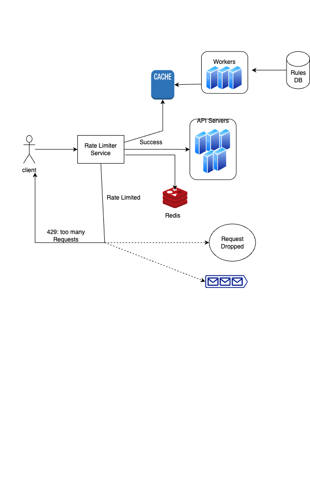

# Design Twitter

## _Fun. / Non-Fun. Requirements_
### Functional Requirements
* Accurately limit excessive requests.
* Use as little memory as possible.
* Distributed rate limiting. The rate limiter can be shared across multiple servers or processes.
* Exception handling. Show clear exceptions to users when their requests are throttled.

### Non-Functional Requirements
* High fault tolerance. If there are any problems with the rate limiter (for example, a cache server goes offline), it does not affect the entire system.
* Low latency. The rate limiter should not slow down HTTP response time.

## _High-Level Architecture_
### Key Components
* **Algorithms for rate limiting**
    * **Token bucket:** A token bucket is a container that has pre-defined capacity. Tokens are put in the bucket ar preset rates periodically. Once the bucket is full, no more are added.
        * e.g.: let's say the bucket capacity is 4. The refiller puts 2 tokens into the bucket every second. Once the bucket is full, extra tokens will overflow. 
            * Each request consumes one token. When a request arrives, we check if there are enough tokens in the bucket. 
            * If there are enough tokens, we take one token out for each request, and the request goes through. 
            * If there are not enough tokens, the request is dropped
   * **Leaking bucket:** The leaking bucket algorithm is similar to the token bucket except that requests are processed at a fixed rate. It is usually implemented with FIFO queue. The algorithm works as follows :
        * When a request arrives, the system checks if the queue is full? if it is not full, the request is added to the queue.
        * Otherwise, the request is dropped.
        * Requests are pulled from the queue and processed at regular intervals. 
   * **Fixed window counter:** The Fixed window counter algorithm divides the timeline into fix-sized time windows and assigns a counter to each window.
        * Each request increments the counter by one.
        * once the counter reached the pre-defined threshold, new requests are dropped until a new time window starts. 
   * **Sliding window log:** the fixed window counter algorithm has a major issue: it allows more requests to go through at the edges of a window. The sliding window log algorithm fixes the issue.
        * It uses a sliding window of time to keep track of requests. 
        * Each request is logged with a timestamp. 
        * When a new request arrives, the system checks the timestamps of all requests in the log and counts how many requests are in the last time window.
        * If the count is less than the threshold, the request goes through. Otherwise, it is dropped.
   * **Sliding window counter:** The sliding window counter algorithm is a hybrid of the fixed window counter and sliding window log algorithms. It uses a fixed number of counters to represent the time window.
        * Each counter represents a fixed time interval.  
        * When a request arrives, the system checks the current time and finds the corresponding counter. 
        * The counter is incremented by one. 
        * If the counter reaches the threshold, new requests are dropped until the next time window starts.

### Workflow
* Rules are stored on the disk. Workers frequently pull rules from the disk and store them in cache
* When a client sends a request to the server, the request is sent to the rate limiter service first.
* Rate limiter service loads rules from the cache. It fetches counters and last request timestamp from the redis cache. Based on the response, the rate limiter decides:
    * if the request is not rate limited, it forwards the request to API servers.
    * if the request is rate-limited, it returns a 429 too many requests error to the client. In the meantime request is either dropped or forwarded to the queue.
### high level design

 