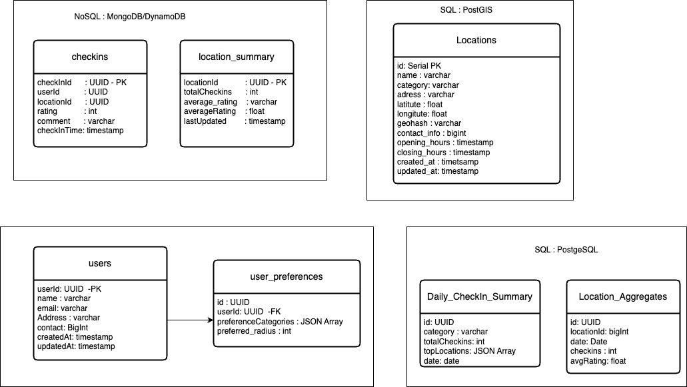

# System Design Mobile Check-In 

## _Fun. / Non-Fun. Requirements_

### Functional Requirements

* User Check-in
    * User can select a location and check-in, providing metadata such as a star rating.
    * The app records user location, time and duration of stay.
* NearBy Recommendations
    * Suggest nearby point of interest (POI's) based on user's current location.
* Batch upload of locations
    * Support for importing location data with metadata in bulk.
* Reports
    * Top N categories with the highest check-ins (daily/monthly/yearly).
    * Most popular places (by check-ins) in a category (daily/monthly/yearly).
    * Best rated places in a category.
* Users should be able to review their location history, view ratings, duration of stay and how often visited.
* lastly, ability to sponsor locations and display them to users.

### Non-Functional Requirements

* **Highly available:**
  The system should be operational and accessible.
* **Performance:**
  Real-time recommendation and efficient report generation.
* **Scalability:**
  Handle a growing number of users and check-ins.
* **Reliability:**
  Ensure accurate data storage and retrieval

## _Traffic Estimation and Data Calculation_

#### Assumptions and storage

1. lets assume total users are 100 million and 20% DAU
    * DAUs = 20M
    * Each user checks in 2 times a day
    * Total check-ins = 20M * 2 = 40M
    * QPS = 40M / 24*60*60 = ~ 460 check-ins/sec
2. Assume 10000 locations are uploaded daily in batch processing and each location metadata size is 2KB
    * Total data uploaded daily = 10000 * 2KB = 20MB/day
3. Analytics data and reports
    * let's Assume aggregated for top N categories and location ~= 1MB/day
4. Total storage
    * Check-ins = 40M
    * Locations = 20MB
    * Reports = 1MB
    * Total storage = 40M * (8 bytes/userID + 8 bytes/locationID + 8 bytes/time + 8 bytes/duration) + 20MB + 1MB 
                    = 40M * 32 bytes + 21MB = 1.2GB + 21MB = 1.2GB + 0.021GB = 1.221GB ~ 1.5GB/Per day

## _API Design_

1. 

## _High-Level Architecture_

### Key Components

1. **Batch Processing Service:** The Batch Processing Service accepts files containing location data (CSV/JSON),
   validates the data, processes it, and updates the Location Service database. It is designed to handle large-scale
   uploads efficiently and without disrupting the system's real-time operations.
    * Step 1: File Upload and Storage:
        * Batch files (e.g., CSV, JSON) are uploaded to an object storage system (e.g., Amazon S3). 
        * Metadata about the file is saved in the Batch Upload Service's database.
    * Step 2: Flink Source
        * Develop a Flink source that reads messages from the SQS queue.
        * When a new message is received from SQS, it will contain details about the uploaded file in the S3 bucket.
    * Step 3: Ingestion into Flink:
        * Flink reads the file directly from the object storage.
        * Filters out invalid rows and routes them to an error sink (e.g., Dead Letter Queue in Kafka or a failed records table in the database).
    * Step 4: Data Processing Pipeline:
        * Parsing:
            * Flink parses the file and converts records into structured objects (e.g., POJOs in Java or Python dictionaries).
        * Validation:
            * Validates fields like latitude, longitude, category, address, etc.
        * Transformation:
            * Converts the data into the required format for the Location Service.
    * Step 5: Flink can write directly to the Location DB if real-time updates are not required.
    * Step 6: Completion and Reporting
        * Once all chunks are processed, the Batch Processing Service sends a completion message to the admin.
        * Generate reports on the number of successful uploads, failed records, and other metrics.
        * the admin is notified of the result via mail or admin panel
2. **Location Service: **
    * The Location Service manages metadata about various locations (e.g., restaurants, parks, cafes) within the system.
    * It stores details like location name, category, address, geospatial coordinates, and hours of operation.
    * The service provides APIs for CRUD operations on locations and supports geospatial queries for nearby recommendations.
    * **APIs:**
        * Add Location: Add a new location to the database.
        * Update Location: Modify an existing location's metadata.
        * Delete Location: Remove a location from the database.
        * Get Location: Retrieve details of a specific location by ID.
        * Get Nearby Locations: Fetch locations within a specified radius of a given latitude and longitude.
    * **Database Schema:**
        * Table: Locations
            ```sql
            CREATE TABLE Locations (
                location_id BIGINT PRIMARY KEY,
                name VARCHAR,
                category VARCHAR,
                latitude DOUBLE,
                longitude DOUBLE,
                address VARCHAR,
                hours VARCHAR
            );
            ```
        * **Geospatial Queries:**
            * Fetch Nearby Locations:
                ```sql
                SELECT *
                FROM Locations
                WHERE ST_Distance_Sphere(
                point(longitude, latitude),
                point(:user_longitude, :user_latitude)) <= :radius
                ORDER BY name;
                ```
            * Get Location Details:
                ```sql
                SELECT *
                FROM Locations
                WHERE location_id = :location_id;
                ```
        * **API Endpoints:**
            * Add Location: POST /locations
                ```json
                {
                    "name": "Joe's Cafe",
                    "category": "restaurant",
                    "latitude": 12.9720,
                    "longitude": 77.5948,
                    "address": "123 Main St",
                    "hours": "09:00-22:00"
                }
                ```
            * Update Location: PUT /locations/:location_id
                ```json
                {
                    "name": "Joe's Cafe",
                    "category": "restaurant",
                    "latitude": 12.9720,
                    "longitude": 77.5948,
                    "address": "123 Main St",
                    "hours": "09:00-22:00"
                }
                ```
            * Delete Location: DELETE /locations/:location_id
            * Get Location: GET /locations/:location_id
            *
3. **Check-In Service:** The Check-In Service is the core component responsible for recording and managing user
   check-ins at various locations. It ensures accurate data capture, updates relevant metrics, and integrates with other
   services like analytics and recommendations.
    * Step 1: User Initiates a Check-In
        * The user selects a location from nearby recommendations or searches for a location.
        * They provide optional metadata such as a star rating or a review.
        * The app sends a request to the Check-In Service.
    * Step 2 : Request validation and processing
        * The Check-In Service validates the request:
            * Ensure the location ID exists(via Location Service).
            * check if the user has already checked in at the location to avoid duplicates.
    * Step 3: Record the check-in:
        * A new check-in record is created in the database:
            * Field include: checkin_id, user_id, location_id, rating, checkin_time, metadata.
    * Step 4: Update Metrics
        * The check-In service publish an event to update metrics:
            * **Location Summary Service:** Increment the check-in count for the location and average rating.
            * **Report Service:** Aggregate check-in data for reports and analytics.(eg: top N categories, popular
              places)
    * Total Check-Ins and Average Rating (Location Summary)
      ```sql
          SELECT 
            locationId,
            COUNT(*) AS totalCheckIns,
            AVG(rating) AS averageRating
         FROM location_summary
            WHERE locationId = :locationId
            GROUP BY locationId;
      ```
    * User Check-In History
      ```sql
          SELECT 
            *
          FROM check_ins
          WHERE userId = :userId
          ORDER BY checkinTime DESC;
      ```
      * Partitioning the Database
         * Partition by Location (locationId):
            * Store all check-ins for a specific location in one partition. 
            * Benefits: Efficient aggregation for location summaries. 
            * Example: Use range or hash partitioning
4. **Recommendation Service:** The Recommendation Service is responsible for providing personalized, location-based
   recommendations to users. Its primary goal is to suggest nearby locations (e.g., restaurants, parks) that match user
   preferences and contextual factors such as location, time, and past behavior. It interacts with other microservices to fetch relevant data, 
   enabling it to deliver personalized, accurate, and timely location recommendations. It achieves this through well-defined APIs and event-driven communication where necessary
    * Interactions with Other Services
      1. Location Service: Fetch metadata and geospatial details of nearby locations.
           ``` json
             GET /locations/nearby?latitude=12.9716&longitude=77.5946&radius=5000
               Response:
                 [
                   {
                    "locationId": "123",
                    "name": "Joe's Cafe",
                    "category": "restaurant",
                    "latitude": 12.9720,
                    "longitude": 77.5948,
                    "address": "123 Main St",
                    "hours": "09:00-22:00"
                   },
                 ]
           ```
      2.  Location Summary Service: Fetch popularity metrics, such as total check-ins and average ratings, for nearby locations.
           ``` json
             POST /location-summaries
               Request:
                      {
                      "locationIds": ["123", "456", "789"]
                      }
               Response:
                 [
                   {
                  "locationId": "123",
                  "totalCheckIns": 1000,
                  "averageRating": 4.5,
                  "lastCheckInTime": "2025-01-11T10:00:00Z"
                   }
                ]
           ```
      3. User Profile Service: Fetch user preferences for personalized recommendations.
           ``` json
             GET /users/{userId}/preferences
               Response:
                 {
                  "preferredCategories": ["restaurant", "park"],
                  "preferredRadius": 5000
                 }
           ```
      4. Sponsored Location Service (Optional): Retrieve sponsored locations to prioritize them in recommendations.
              ``` json
                 GET /sponsored-locations ? latitude=12.9716&longitude=77.5946&radius=5000
                Response:
                  [
                     {
                      "locationId": "123",
                      "name": "Joe's Cafe",
                      "category": "restaurant",
                      "latitude": 12.9720,
                      "longitude": 77.5948,
                      "address": "123 Main St",
                      "hours": "09:00-22:00"
                     },
                  ]
              ```
      5. Check-In Service : Analyze recent user check-ins for personalization and trend detection.
           ``` json
             GET /checkins/user/{userId}/recent
               Response:
                 [
                   {
                    "locationId": "123",
                    "checkInTime": "2025-01-11T10:00:00Z",
                    "rating": 4.5
                   },
                 ]
           ```
         
    * **How the Recommendation Service Orchestrates These Calls**
        * Step 1: Fetch Nearby Locations
            * Query the Location Service to retrieve nearby locations based on the user's current location and radius.
        * step 2 : Enrich Data with Metrics
            * Query the Location Summary Service to retrieve aggregate statistics for those locations (e.g., check-ins, ratings). 
        * Step 3: Retrieve User Preferences
            * Query the User Profile Service to fetch user preferences like preferred categories and radius.
        * Step 4: Include Sponsored Locations
            * Query the Sponsored Location Service to prioritize active sponsored locations.
        * Step 4: Personalize Recommendations
            * Analyze recent user check-ins and preferences to personalize recommendations.
            * Rank locations based on popularity, user preferences, and contextual factors.
        * Step 5: Rank and Return Results
            * Combine the data, apply a ranking algorithm (e.g., weighted scores based on distance, ratings, and check-ins), and return the final list of recommendations to the user.

5. **User profile Service :** The User Profile Service manages user-related information, preferences, and history within the system. It is responsible for storing and retrieving user details, preferences, and behaviors to enable personalized experiences such as tailored recommendations and user-specific insights.
      * User Profile Management
         * Users can create or update their profiles via APIs.
            * Example:
                * Create profile: { "userId": "abc123", "name": "John Doe", "email": "john.doe@example.com" }
                * Update preferences: { "userId": "abc123", "preferredCategories": ["restaurant", "park"], "preferredRadius": 1000 }
      * Retrieve Preferences
         * The Recommendation Service queries the User Profile Service to retrieve user preferences for personalized results.
      
6. **Report Service:** The Report Service is responsible for generating various analytical reports, such as:
     * Top N categories with the highest number of check-ins for a given period (day/week/month).
     * Locations with the most check-ins within a category.
     * Locations with the highest user ratings within a category.
     * To generate these reports, the system can use pre-aggregated data generated by Apache Flink or similar stream-processing frameworks.
         *  Role of Pre-Aggregated Data
             * Apache Flink listens to check in events (via Kafka) and processes them in real-time to generate summaries, such as:
               * Total check-ins per location per time period. 
               * Check-ins grouped by category. 
               * Top-rated locations per category. 
               * These summaries are stored in a cache (e.g., Redis) or a dedicated analytics database for quick access by the Report Service.
     * Detailed Workflow: 
        * Listen to Check In Events: The Check-In Service publishes events to Kafka (e.g., when a user checks in at a location).
          ```json
                  {
                    "userId": "12345",
                    "locationId": "67890",
                     "timestamp": "2025-01-13T10:15:30Z",
                     "rating": 4
                  }
           ```
         * Real-Time Updates (Apache Flink):
             * Apache Flink processes Kafka events from the Check-In Service to compute:
             * Total check-ins per location or category. 
             * Top N categories or locations by check-ins. 
             * Average ratings for locations.
        * Storage of Pre-Aggregated Data:
            * The aggregated data is stored in:
            * Redis Cache: For quick, low-latency access. 
            * Analytics Database: For storing historical trends and larger datasets.
        * Report Generation:
            * When a report request is received:
               * The Report Service queries the pre-aggregated data for summary information. 
               * It queries the Location Service for additional metadata (e.g., location name, category). 
               * Combines the data to generate the final report.

### high level design


### Database Design

1. Users: Represents users of the system.
2. Locations: Stores metadata about points of interest (POIs) like restaurants, parks, etc.
3. Check-Ins: Tracks user check-ins to specific locations.
4. Categories: Classifies locations into categories (e.g., restaurants, cafes, parks).
5. Ratings and Reviews: Stores user ratings and reviews for locations.
6. Recommendations: Logs suggested locations and related metadata.
7. Trending Analytics: Stores aggregated metrics for trending locations and categories.




* 