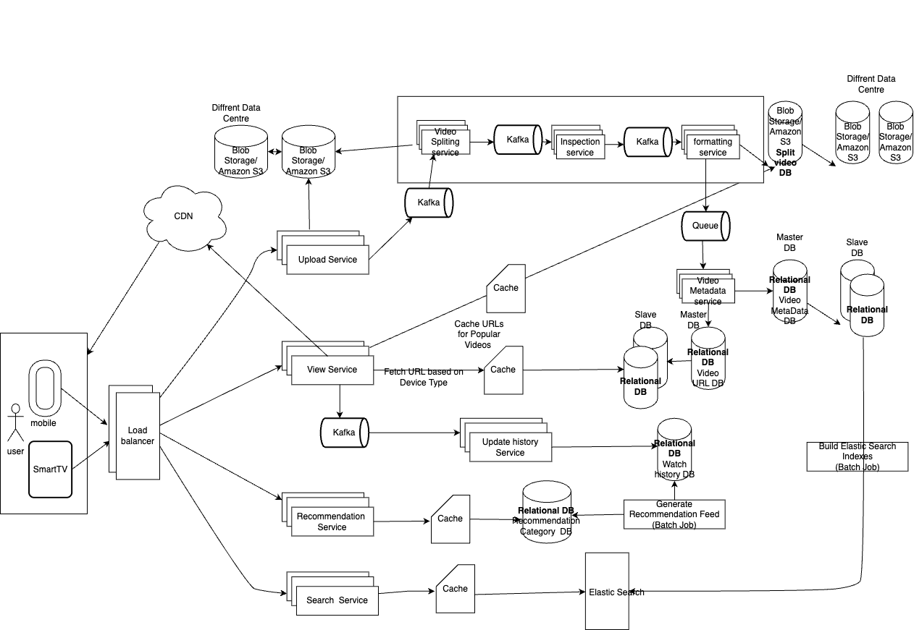

# Design Netflix/PrimeVideo/Hotstar/YouTube

## _Fun. / Non-Fun. Requirements
### Functional Requirements

1. User should be able to upload a video.
2. Users should be able to search for a video.
3. User should be able to view a video.
4. Support all devices (Mobile, Web, TV).
5. User Should have a homepage with recommended videos.


### Non-Functional Requirements

1. The System should be Highly available.
2. The System should support uploading large and streaming large videos.
3. The System should allow for low latency streaming of videos even in the low bandwidth.
4. The System should scale to high number of videos uploaded and watched per day 
5. The System should support resumable uploads.

## _Traffic Estimation and Data Calculation_
#### Assumptions
1. DAU: 100M users * 2 times a day

#### throughput requirement

* QPS = 100M * 2 / (24hrs * 60min * 60sec) = 100 * 10^6 * 2 / 10^5 ~= 2K QPS

#### storage estimation

* 10:1 viewers: creator ratio
  100M viewers -> 10M creators
* Assuming a user uploads video 2 times a week and each video is 5GB

    ```text
     Storage capacity = 10M creators * 2 times/week * 5GB 
                      = 10 * 10^6 * 2 times a week * 4 weeks * 12 months * 5GB
                      = 10 * 10^6 * 100 * 5 * 10^9
                      = 10 * 10^6 * 500 * 10^9
                      = 10^15 * 5000
                      = 5000 PB/year
    
    ```

## _API Design_

* **Upload Video API**
    * **POST /videos**
        * Request Body: { video: file, metadata: { title, description, tags, etc. } }
        * Response: { status: success/failure, videoId }
* play video API
    * **GET /videos/{videoId}**
        * Response: { videoUrl, metadata: { title, description, tags, etc. } }

      
## _High-Level Architecture_
### Key Components
1. **Upload & Ingestion Pipeline**
    * **Upload Service:** This component is responsible for handling the upload of videos (maybe through SFTP server:An SFTP server is a system that facilitates secure file transfer, remote file access, and file management over a network using the Secure Shell (SSH) protocol). It should support resumable uploads and chunked uploads to handle large files.
    * **Blob Storage (e.g., Amazon S3/Azure blob storage)**: Stores raw uploaded videos.
    * **Kafka**: once the video is uploaded, it will be published to a Kafka topic. This will allow for decoupling of the upload service from the processing service.
2. **Video Processing Pipeline**
    * **Video Splitting Service:** Breaks videos into smaller chunks for adaptive bitrate streaming. after splitting, it will publish the chunks to a Kafka topic.
    * **Inspection service:** Validates content, checks compliance, and extracts technical metadata. This service inspects the video for quality and metadata extraction. It can use FFmpeg or similar libraries to analyze the video.
    * **Formatting Service:** Transcode videos into multiple resolutions and formats and the Processed videos are stored in Split Video DB (S3), distributed across data centers. Once all the chunks are processed, it will publish the metadata to a Kafka topic.
3. **Metadata Management**
    * **Video Metadata Service:** Associates videos with titles, categories, creators, duration, etc.
    * **Video MetaData DB and Video URL DB:**
        * Use master-slave relational DB setups. 
        * Store structured metadata and storage pointers for video playback.
4. **Video Playback / View Flow**
    * **View Service:**
        * Fetches appropriate URLs for video playback based on a device type. 
        * Interacts with cache to serve popular videos faster. 
    * Logs view events via Kafka to feed user history and analytics pipelines.
    * **User History Service:** Whenever a user watches a video, it will log the event to a Kafka topic. This service will consume the events from the Kafka topic and update the user history DB.
* **Video Search**
    * **Search Service:** This service searches for videos based on user queries from ElasticSearch. ElasticSearch data is generated from video metadata db via a batch job.
* **Recommendation Engine**
    * **Recommendation Service:** Generate a Recommendation Feed batch job will generate recommendation category wise and store it into recommendation DB. Recommendation Service will fetch the recommendation from the recommendation DB and serve it to the user.
* **Content Delivery & Edge Layer**
    * **CDN** (Content Delivery Network): Delivers video chunks closest to users to reduce latency and increase load speed.
    * **Cache Layer:** Stores frequently accessed URLs and video chunks, particularly for popular content and device-optimized streams
### _End-to-End Request Flow_


### high level design


### Database Design


### _Questions_
1. 
