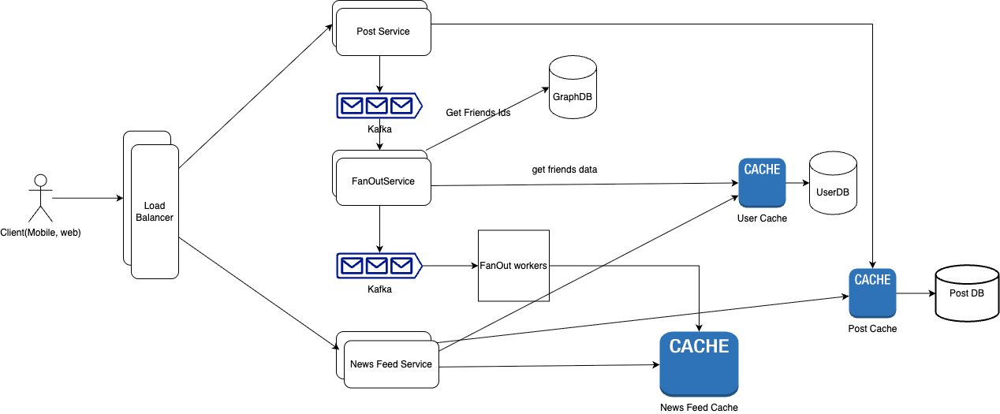

# Design News Feed System for Social Media

## _Fun. / Non-Fun. Requirements_
### Functional Requirements
1. view feed
2. create a post (picture/text)
3. like & comments on a post
4. follow/unfollow users
5. search for users

### Non-Functional Requirements
1. like/comment should be in real time(low latency)
2. view posts (Eventual Consistency)


## _Traffic Estimation and Data Calculation_
#### Assumptions
1. MAU: 2B
2. DAU = 2 * 10^9 / 30 = 66.67M
   
   ```text
    Lets assume 50% of users are posting 3 times a month
     = 1B users * 3 times / 30days
     = 1 * 10^9 * 3 / 30
     = 10^8  posts/day
     = 100 * 10^6 posts/day
     = 100M posts/day
    ```

#### Data Storage
* assuming that average post-size is 10MB
   ```text
       Storage capacity = 100M posts/day * 10MB
                        = 100 * 10^6 * 1MB
                        = 100 * 10^6 * 10^6 bytes
                        = 100 * 10^12 bytes
                        = 100TB/day
   ```


## _API Design_

      
## _High-Level Architecture_
### Key Components


### _End-to-End Request Flow_


### high level design


### Database Design


### _Deep Dive into Key Components_
