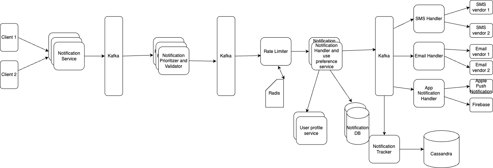

# Design Notification System

## _Fun. / Non-Fun. Requirements
### Functional Requirements

1. Send notifications
2. Pluggable and extendable
3. Saas - we might need to impose rate limit — it could be to avoid spamming a user with promotional messages or to avoid overloading the system
4. Prioritization — certain messages like OTP are higher priority than promotional messages

### Non-Functional Requirements

1. High availability. (The service should be up 99.99999% of the time)
2. Easy enough to add more clients
3. Scalable: Should be linearly scalable if we want to expose this as a service to other companies or clients

## _Traffic and Storage Estimation_
#### Assumptions

* **Users**: Assume the system serves 50 million daily users.
* **Notifications per user**: On average, each user receives 5 notifications/day.
   * 50 million x 5 = 250 million notifications/day
   * 250 million / 24 hours * 3600 seconds = ~3K notifications/second
   * peak load: 3K * 5 (5 times more) = 15K notifications/second
#### Storage
* Assuming average notification and user data size of 1KB.
   * Storage for user data: 50 million * 1 KB = 50GB 
   * Daily Storage for notifications: 50 million * 5 * 1 KB = 250GB
   * Monthly Storage: 250GB * 30 = 7.5TB

## _API Design_

      
## _High-Level Architecture_

### Key Components
1. **Notification service**
    * which we will use to interact with clients. Now clients can send two types of requests. It could have some content and a channel over which the notification has to be sent for example email, or the request could have a user id and the content and the system decides the channel over which the notification is sent.

2. **Kafka**
    * The notification service will now send the request to Kafka, which will pass on the request to **Notification validator and prioritizer** which performs basic validations like email should not be null or invalid.
    * In addition to this, based on some identifiers, say message type, it will decide the priority of the message. For eg, OTP gets a very high priority as it is blocking the user from logging in as opposed to a promotional message. Once the priority of the message is decided, the message will be forwarded to different Kafka topics for different priority levels, and the consumers while picking the requests will first pick the message from a high priority topic, then medium, then low priority messages.This is because we cannot afford a lag on high priority messages, but we are ok with a slight lag in case of lower priority messages.
   
3. **Rate limiter**
   * Rate limiter performs two kinds of checks—if the client is allowed to send these many requests, and if the user is supposed to get these many notifications. It could be based on which subscription plan a client has chosen in case some external party is using this system. It could also be based on a configuration that sets the maximum number of promotional messages a user is supposed to receive.
   * Both types of limiting will be implemented using a certain key, which is inserted in a Redis for a certain time frame when a request comes with that key. When that rate limit is exceeded, the request is dropped.

4. **Notification handler and user preferences service**
   * Now users could have unsubscribed for promotional notifications or specified a preferred channel for receiving the promotional messages. This is taken care of by the user preferences side of this service. It will interact with a Preferences DB - which stores the user preferences, and a user service—to fetch the user’s information before sending the notification

5. Once we have the contact information, contact channel, and the content, we can proceed with sending the notification to the user. At this point, we will send an event to Kafka along with all this information. Kafka will further be connected to multiple handlers that will handle requests of various message types. For example, SMS requests will go to the SMS handler, etc. There could also be different Kafka topics for each type of request. Now continuing with the SMS request example, SMS service will be interacting with multiple SMS vendors to send SMSs in India, US, Europe, etc. Similarly, if you have multiple vendors that can send SMSs in India then which requests go to which vendor and on what priority etc will also be handled by SMS handler. Similarly, the email handler will interact with an email vendor to send out the emails. We will also have an in-app handler to send out the in-app notifications, it could use Firebase or other push notification services for sending out these notifications. There will also be an IVRS handler to send out IVRS confirmation or feedback calls.

6. Remember the pluggability requirement? Suppose at a later point we need to add Whatsapp as a notification mechanism. All we need to do is add WhatsApp as a notification type or a message type and add a WhatsApp handler. Now any requests for WhatsApp notifications will be directed to the WhatsApp handler.

7. Notification tracker
   * The next component in our system is a Notification tracker, which keeps a track of notifications we send out for auditing purposes, which stores all the notifications permanently in a Cassandra.

### high level design

### _Questions_
1. Handling Failures and Retries,
   * If a notification delivery fails due to a temporary issue (e.g., third-party provider downtime), the Channel Processor will attempt to resend the notification.
   * Typically, an exponential backoff strategy is used, where each retry is delayed by progressively longer intervals.
   * If the notification remains undelivered after a set number of retries, it is moved to the Dead Letter Queue (DLQ) for further handling.
   * Administrators can then manually review and reprocess messages in the DLQ as needed.
2. Reliability
   * For high availability, data (e.g., user preferences, logs) should be replicated across multiple data centers or regions. This ensures that even if one region fails, the data is available elsewhere. 
   * Multi-AZ Replication: Store data in multiple availability zones to provide redundancy.
3. Monitoring and Logging
    * To ensure smooth operation at scale, the system should have:
         * Centralized Logging: Use tools like ELK Stack or Prometheus/Grafana to collect logs from various components and monitor the health of the system. 
         * Alerting: Set up alerts for failures (e.g., notification delivery failure rates exceed a threshold). 
         * Metrics: Track metrics like success rate, failure rate, delivery latency, and throughput for each channel.