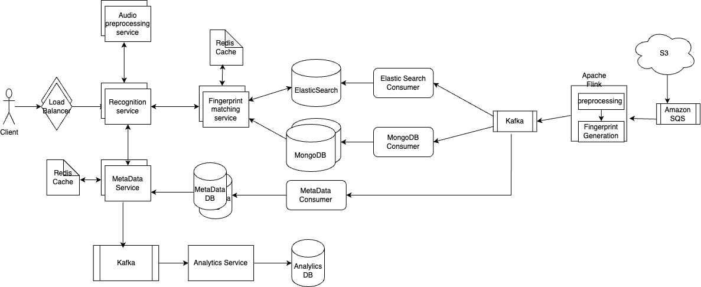
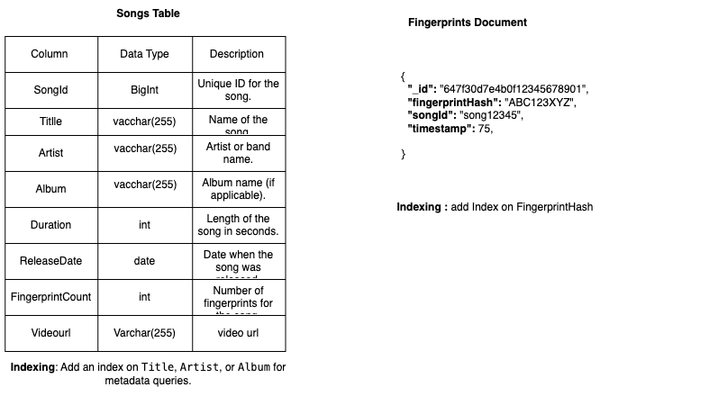

# Design Shazam Like Application with Song Identification

## _Fun. / Non-Fun. Requirements_

### Functional Requirements
* Efficiently preprocess and store fingerprints for millions of songs.
* As a user, I should be able to record an audio and the system should identify return the song from the audio.

### Non-Functional Requirements
* **Highly available:**
  The system should be operational and accessible whenever users attempt to identify a song.
* **Low latency:**
  Low latency in Shazam's system means that the time from when a user records a sample to when they receive identification should be minimal
* **Scalability:**
  Shazam must handle a large and potentially unpredictable number of requests from users around the world.
  scalability ensures that as the user base grows and request volume increases, the system can handle the additional load without performance degradation.
* **Robustness:** Shazam's system should handle and recover from various kinds of failures, such as incorrect song samples, noisy environments, or partial system outages, without crashing or losing functionality.
  It should also manage a wide variety of music and audio quality and be able to accurately identify songs despite these variables.


## _Traffic Estimation and Data Calculation_
#### Assumptions and storage
1. Assume that there are around 100 millions songs and size of per song is 5MB and its metadata is 1KB.
   => 100M * 1KB = 100 * 10^6 * 1*10^3 = 100 * 10^9 = 100GB
2. There is no need to store the songs as it could lead to additional storage as well as compliance concerns regarding the rights of the songs.
   Regarding the storage of the metadata, it will require around 100GB (1KB * 100 million songs) of storage.
3. let's assume each song can produce 30 fingerprints of 64 bits each
   30 fingerprints of 64 bits each = 30 * 64 = 1920 bits = 240 bytes
   => 100M * 24 bytes = 100 * 10^6 * 24 = 2400 * 10^6 = 2.4GB
4. QPS
   * Let's assume that we have total of 100 million users.
   * DAU is 20% of total users and each user makes 10 requests per day.
   * Total requests per day = 20M * 10 = 20M * 10^1 = 200M
   * Total requests per second = 200M / (24 * 3600) = 200M / 86400 = 200M / 10^5 = 2000 QPS

## _API Design_

1. **Identify the song**
   * Endpoint: POST v1/audio/
   * Request Body: 
     * form-data 
     * Key: file 
     * Value: (Audio file)
   * Response:
     ```json
        {
             "song": {
                     "title": "Blinding Lights",
                     "artist": "The Weeknd",
                     "album": "After Hours",
                     "release_date": "2019-11-29",
                     "duration": "3:22",
                     "genre": "Synthwave, Pop"
                    },
          "links": {
                     "spotify": "https://open.spotify.com/track/0VjIjW4GlUZAMYd2vXMi3b",
                     "apple_music": "https://music.apple.com/track/0VjIjW4GlUZAMYd2vXMi3b",
                     "youtube": "https://www.youtube.com/watch?v=fHI8X4OXluQ"
                 }
     }
     ```

## _High-Level Architecture_
### Key Components
1. Raw Audio Processing : Audio is stored in S3 and sent to the preprocessing service via Apache Flink.
2. Fingerprint Generation: Fingerprints are processed in Apache Flink and extract 20-30 unique fingerprints from each song published to Kafka. 
3. Storage and Processing: 
   * Fingerprints are consumed by two consumers:
        * ElasticSearch Consumer writes fingerprints into ElasticSearch for fast retrieval during song recognition.
        * MongoDB Consumer stores the fingerprints in MongoDB, likely for backup, analytics, or transactional consistency. 
   * Song metadata are consumed by metadata consumer which stores metadata in MongoDB:
        * Metadata includes song title, artist, album, genre, and other relevant information.
4. ElasticSearch: An inverted index is highly useful in the fingerprint matching process for Shazam because it enables efficient lookup of potential matches for the user's fingerprint.
   * An inverted index is a data structure that maps unique keys (in this case, fingerprints) to a list of associated identifiers (here, SongIDs).
     Structure of an Inverted Index for Shazam:
      * Key: A fingerprint hash (unique audio signature generated during preprocessing).
      * Value: A list of SongIDs that contain this fingerprint.
          ```
           FingerprintHash -> [SongID1, SongID3]
           FingerprintHash -> [SongID2]
           FingerprintHash -> [SongID1, SongID4, SongID5]
          ```
   * Why is an Inverted Index Useful for Shazam?
      * When a user submits an audio snippet, the system generates a single fingerprint for it. To identify the song, the backend must find all songs containing this fingerprint from potentially millions of songs in the database. An inverted index makes this lookup efficient and scalable.
      * Without an Inverted Index:
         * The system would have to scan through all fingerprints in the database, comparing the user fingerprint with each one.
         * This is highly inefficient and scales poorly as the database grows.
      * With an Inverted Index:
         * The system directly queries the inverted index with the user fingerprint hash.
         * It retrieves only the relevant SongIDs, skipping irrelevant data.
         * The complexity of the lookup is significantly reduced.
   * How Does It Work in Shazam?
       * Step-by-Step Workflow:
          * Preprocessing Phase (Building the Index):
             * For each song:
                 * Generate 20-30 fingerprints using the "processing" algorithm.
                 * Add each fingerprint to the inverted index with the associated SongID.
                   Example:
                    ```
                     For SongID1, fingerprints: Hash1, Hash2, Hash3.
                     For SongID2, fingerprints: Hash2, Hash4.
                   
                     Resulting Index:
                        Hash1 -> [SongID1]
                        Hash2 -> [SongID1, SongID2]
                        Hash3 -> [SongID1]
                        Hash4 -> [SongID2]
                   ```
          * Matching Phase (Querying the Index):
             * When a user submits an audio snippet, 
                * Generate a single fingerprint (HashX) from the snippet.
                  * The backend generates fingerprints for the user’s 5-10 second audio snippet. Let's assume the system extracts 5 fingerprints: F1, F2, F3, F4, F5.
                * Query the Inverted Index for Each Fingerprint.
                  * For each fingerprint (e.g., F1, F2), retrieve a list of potential matching SongIDs from the inverted index.
                      ```
                       F1 -> [SongID1, SongID2]
                       F2 -> [SongID1, SongID2]
                       F3 -> [SongID1, SongID3]
                       F4 -> [SongID1, SongID4]
                       F5 -> [SongID2, SongID3]
                      ```
                * Aggregate Candidate Songs:
                  ```
                     Candidate Songs: [SongID1, SongID2, SongID3, SongID4]
                  ```
                * Retrieve Full Fingerprints for Each Candidate Song:
                   * Fetch the full set of precomputed fingerprints for each candidate song from the fingerprint database.
                     ```json
                        SongID1 -> [S1, S2, S3, S4, S5, S6, S7, S8]
                        SongID2 -> [S9, S10, S11, S12, S13]
                        SongID3 -> [S14, S15, S16, S17, S18]
                        SongID4 -> [S19, S20, S21, S22]
                         ```
                * Compare User Fingerprints with Each Song's Fingerprints:
                   * For each candidate song, compare the user’s fingerprints (F1, F2, F3, F4, F5) with the song’s full fingerprints.
                   * Calculate a confidence score based on:
                       * Number of overlapping fingerprints: Count how many fingerprints from the user snippet match the song's fingerprints.
                       * Temporal alignment: Check whether the matched fingerprints occur in a consistent time offset between the snippet and the song.
                * Determine the Best Match:
                   * Select the song with the highest confidence score as the match.
                   * If confidence scores are close, apply additional heuristics, such as:
                       * Length of the snippet.
                       * Frequency of shared fingerprints among multiple songs (e.g., penalize overly common fingerprints that appear in many songs).
5. Recognition Service: 
   * **Functionality:**
      * Receives audio snippets from users.
      * calls the **AudioPreprocessing Service** to generate fingerprint.
      * Once unique fingerprint is available, it calls **fingerprint matching service**.
      * fingerprint matching service first check in the redis cache, if fingerprint found it returns the songId otherwise it queries the ElasticSearch inverted index to find candidate song.
      * Recognition Service receives the songId and calls **metadata service**.
      * Metadata service first check in the redis cache, if fingerprint found it returns, otherwise queries to metadata DB and returns the song details to the Recognition Service.
      * Returns the matched song to the user.
   * **Components:**
      * **Audio Fingerprinting Module:**
         * Generates unique fingerprints for audio snippets.
         * Converts audio signals into compact representations.
      * **Matching Algorithm:**
         * Compares user fingerprints with song fingerprints.
         * Calculates confidence scores for each candidate song.
      * **Querying Module:**
         * Retrieves candidate songs from the ElasticSearch inverted index.
         * Fetches full song fingerprints for comparison.
      * **Result Generation:**
         * Selects the best match based on confidence scores.
         * Returns the matched song to the user.
6. Matching Service :
    * **Functionality:**
        * Compares user fingerprints with song fingerprints.
        * Calculates confidence scores for each candidate song.
        * Selects the best match based on the scores.
    * **Components:**
        * **Fingerprint Comparison:**
            * Compares user fingerprints with song fingerprints.
            * Identifies overlapping fingerprints.
        * **Scoring Algorithm:**
            * Calculates confidence scores based on the number of matches.
            * Considers temporal alignment and other heuristics.
        * **Selection Logic:**
            * Chooses the song with the highest confidence score.
            * Applies additional heuristics if needed.
* Song MetaData Service: 
    * **Functionality:**
        * Stores metadata for each song.
        * Provides song details for matching and identification.
    * **Components:**
        * **Metadata Storage:**
            * Stores song metadata, such as title, artist, album, genre.
            * Associates metadata with song fingerprints.
        * **Metadata Retrieval:**
            * Fetches song metadata for matched songs.
            * Provides details to the Recognition Service.

### high level design


### Database Design


### _Questions_
1. How do you ensure that you can quickly respond? 10 million concurrent users on Friday and Saturday nights? 
   * Shard the Inverted Index:
      * Partition the inverted index by FingerprintHash to distribute the workload across multiple servers or databases.
      * Example: Use consistent hashing or range-based sharding to divide hashes across shards.
   
   * Cache Hot Fingerprints:
      * Use an in-memory cache (e.g., Redis or Memcached) for frequently queried fingerprints.
      * Hot fingerprints often represent popular or trending songs.
   * Use Load Balancers:
      * Distribute incoming requests across multiple Recognition Service instances.
      * Deploy global load balancers (e.g., AWS ELB, Google Cloud Load Balancer) to route user requests to the nearest backend instance.
      * Use geo-distribution to reduce latency by placing servers closer to users.
   * Horizontal Scaling: 
        * Add more Recognition Service instances to handle increased load.
        * Use auto-scaling groups to automatically adjust the number of instances based on traffic.
   * CDN for Static Content
       * Use a Content Delivery Network (CDN) for serving static content (e.g., app assets, song previews).
   * Monitoring and Observability
        * Real-Time Monitoring
           * Use tools like Prometheus, Grafana, or Datadog to monitor:
              * Query latency.
              * CPU and memory usage.
              * Error rates and dropped requests.
        * Alerting
             * Set up alerts for anomalies, such as:
             * High error rates.
             * Slow query times.
             * System resource exhaustion.
