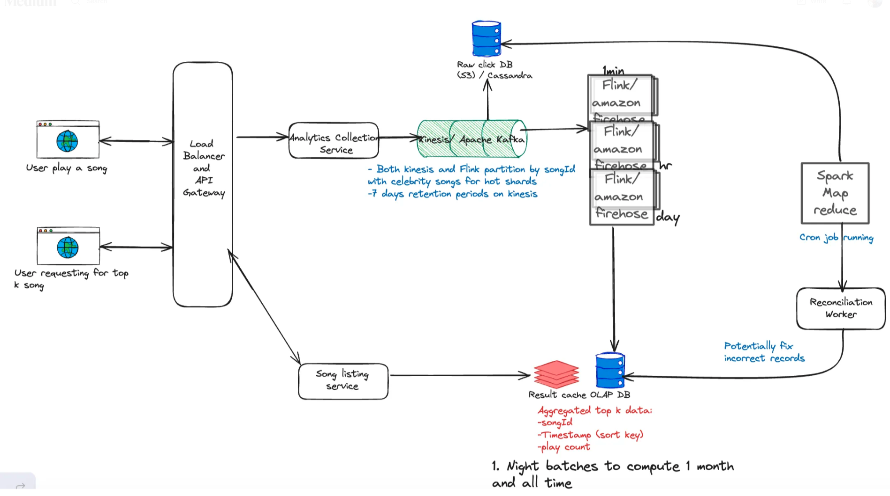

# Design Top k Youtube Videos/Songs Played

## _Fun. / Non-Fun. Requirements_
### Functional Requirements
* Top k(1000) most played songs in the past period (say 1 hour, 1 day, 1 month, all time) with real-time update.
* Record and count the songs as they’re being played by end users.

### Non-Functional Requirements
* Highly available
* Low latency
* Scalable
* We should return results within 10’s of milliseconds — min latency and need for pre computing.


## _Traffic Estimation and Data Calculation_
#### Assumptions and storage
1. DAUs = 500M and each listens to 10 songs
   total 500M * 10 = 5B
2. the number of clicks per second (QPS) = 5B clicks/24*60*60 = 5*10^9/10^5=50*10^3 = 50k QPS
3. total songs = 50k per day
   store for 10 years = 50k * 365 * 10 ~ 200 million
   Storage estimated: 200 M * (8 bytes/ID + 8 bytes/count) = 3.2GB = ~ 4 GB


## _API Design_

1. **Retrieve the top k songs**
    * Endpoint: GET /plays/top?window={WINDOW}&k={K}
    * Response:
      ```json
      {
         "videos": [
                    {
                     "videoId": "video1344545",
                      "views": 123213
                    },
                   .....
                   ]
      }
      ```

## _High-Level Architecture_
### Key Components

1. **Users play a song**: When a user plays a song, the event is captured by the client application (e.g., a web browser or mobile app). The event data includes details such as the song ID, the time of play, and user information.
2. **Load Balancer and API Gateway**: This component acts as the entry point for all incoming requests from user clients. It distributes incoming traffic and requests across multiple servers or services to balance load and enhance performance and reliability.
3. **Analytics collection service**: Handles the ingestion and initial processing of analytics data from song play events.
   **Function:**
   Kafka captures and stores the incoming song play data, ensuring durability and fault tolerance.
   It’s partitioned by song ID, with partitions for popular songs to manage load effectively.
   Kinesis is used for its stream processing capabilities, particularly for partitioning and retaining data (with a 7-day retention period mentioned).
4. **Apache Flink with Amazon Firehose**:
    * Purpose: To process streaming data at different time scales.
    * 1-Minute, 1-Hour, and 1-Day Windows: Flink jobs are set up to aggregate song play data over these windows. Each job calculates play counts and possibly other metrics like unique listeners.
    * **Amazon Firehose:** Integrates with Flink to reliably load the streaming results into subsequent storage or databases for further analysis or immediate querying.
5. **Spark MapReduce** :
    * **Purpose:** To perform heavy-duty batch processing, particularly for longer-term data aggregations (e.g., monthly).
    * **Function:** Runs nightly batch jobs to compute top K listings for periods like the past month or all-time. This is typically more resource-intensive and done less frequently.
6. **Reconciliation Worker** :
    * **Purpose:** To check and correct any discrepancies or errors in the data processed by Flink or Spark.
    * **Function:** This component runs as a cron job, verifying the integrity and accuracy of the data in the Result Cache and fixing incorrect records, ensuring the data’s reliability.
7. **Songs Plays Data Store (OLAP)**: Stores detailed records of each song play event. Manages a high volume of write operations as songs are played across the platform. Ensures data is consistently and reliably stored, albeit with eventual consistency, meaning it might take some time before all views of the data are consistent.
8. **Result Cache (OLAP Database)**
    * **Purpose**: To store the results of the top K song computations in a way that’s optimized for quick retrieval.
    * **Function**: This database caches the top K results, storing data such as song ID, timestamps, play counts, and possibly other metrics. It supports fast, efficient queries from the Song Listing Service.
9. **Song Listing Service**:
    * **Purpose**: To handle incoming queries for top K songs and serve the results to users.
    * **Function**: Retrieves the latest top K results from the OLAP DB Result Cache and delivers them to users in response to their queries.

### high level design


### Database Design

1. songs, view and time window
   ```json
        {
        "song_list" : {
                       "song_id": 123,
                       "user_id": 5678,
                       "timestamp" : 127800988978
                      }
        }
   ```
### _Questions_
1. How can we scale to support 50k clicks per second?
   Let’s walk through each bottleneck the system could face from the moment a click is captured and how we can overcome it:
    * **Click Processor Service:** We can easily scale this service horizontally by adding more instances. Most modern cloud providers like AWS, Azure, and GCP provide managed services that automatically scale services based on CPU or memory usage. We’ll need a load balancer in front of the service to distribute the load across instances.
    * **Stream:** Both Kafka and Kinesis are distributed and can handle a large number of events per second but need to be properly configured. Kinesis, for example, has a limit of 1MB/s or 1000 records/s per shard, so we’ll need to add some sharding. Sharding by songID is a natural choice, this way, the stream processor can read from multiple shards in parallel since they will be independent of each other (all events for a given songID will be in the same shard).
    * **Stream Processor:** The stream processor, like Flink, can also be scaled horizontally by adding more tasks or jobs. We’ll have a separate Flink job reading from each shard doing the aggregation for the AdIds in that shard.
    * **OLAP Database:** The OLAP database can be scaled horizontally by adding more nodes. While we could shard by songID, we may also consider sharding by AdvertiserId instead. In doing so, all the data for a given advertiser will be on the same node, making queries for that song faster. This is in anticipation of advertisers querying for all of their active ads in a single view. Of course, it’s important to monitor the database and query performance to ensure that it’s meeting the SLAs and adapting the sharding strategy as needed.
2. There is just one remaining issue, hot shards.
   Consider the case where Taylor swift just released a new song. This song is getting a lot of plays and all of them are going to the same shard. This shard is now overwhelmed, which increases latency and, in the worst case, could even cause data loss.
   To solve the hot shard problem, we need a way of further partitioning the data. One popular approach is to update the partition key by appending a random number to the songID. We could do this only for the popular songs as determined by artist’s previous record volume. This way, the partition key becomes SongId:0-N where N is the number of additional partitions for that SongId.
3. How can we ensure that we don’t lose any click data?
    * By default, these streams are distributed, fault-tolerant, and highly available. They replicate data across multiple nodes and data centers, so even if a node goes down, the data is not lost. Importantly for our system, they also allow us to enable persistent storage, so even if the data is consumed by the stream processor, it is still stored in the stream for a certain period of time.
    * We can configure a retention period of 7 days, for example, so that if, for some reason, our stream processor goes down, it will come back up and can read the data that it lost from the stream again.
    * Stream processors like Flink also have a feature called checkpointing. This is where the processor periodically writes its state to a persistent storage like S3. If it goes down, it can read the last checkpoint and resume processing from where it left off. This is particularly useful when the aggregation windows are large, like a day or a week. You can imagine we have a weeks worth of data in memory being aggregated and if the processor goes down, we don’t want to lose all that work.
    * Transient processing errors in Flink, bad code pushes, out-of-order events in the stream?
      We can lose if not add periodic reconciliation
      At the end of the stream, alongside the stream processors, we can also dump the raw click events to a data lake like S3. Flink supports this through its FileSystem interface and various connectors, allowing for both batch and real-time data processing outputs to be stored directly in S3 buckets. Then, we can run a batch job that reads all the raw click events from the data lake and re-aggregates them. This way, we can compare the results of the batch job to the results of the stream processor and ensure that they match. If they don’t, we can investigate the discrepancies and fix the root cause while updating the data in the OLAP DB with the correct values.
      This essentially combines our two solutions, real-time stream processing and periodic batch processing, to ensure that our data is not only fast but also accurate.
4. How can we prevent abuse from users clicking on play multiple times?
    * While modern systems have advanced fraud detection systems, which we have considered out of scope, we still want to come up with a way to enforce song play Idempotency. ie. if a user clicks on an ad multiple times, we only count it as one click.
