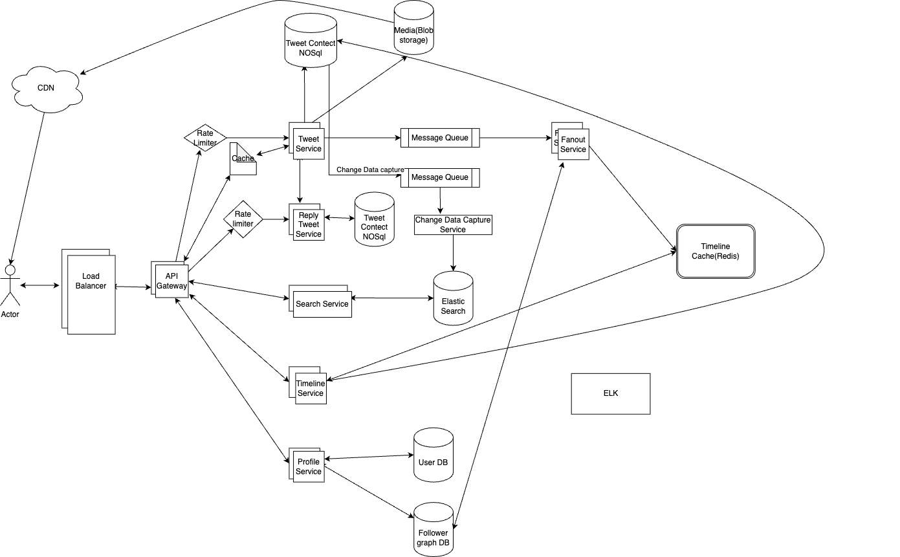

# Design Twitter

## _Fun. / Non-Fun. Requirements_
### Functional Requirements
1. Create an account and login
2. Create, Edit and Delete a tweet
3. Follow other users
4. View a timeline of tweets from followed users
5. Like, Reply and retweet tweets
6. Search for tweets and users

### Non-Functional Requirements

1. Scale to 100+ million of users
2. Handle a high volume of tweets, likes and retweets
3. Highly available (99.999% uptime)
4. Security and Privacy of user data
5. Low latency for real-time interactions

## _Traffic Estimation and Data Calculation_
#### Assumptions
1.
#### Data Storage
1.

## _API Design_
 
      
## _High-Level Architecture_
### Key Components

1. Tweet Crud Service
   * Handles creating, reading and deleting tweets.
   * Write to tweet content DB. 
   * Publishes a message to queue (eq: kafka) for fanout processing.
   * Feeds into: 
     * Timeline fanout Service
     * Search Service (via CDC)
2. Reply CRUD Service
   * Manages replies to tweets.
   * Interacts with a replica db.
   * Also Published CDC events to be consumed doqnstream.
### _End-to-End Request Flow_

### high level design

### Database Design

### _Deep Dive into Key Components_
