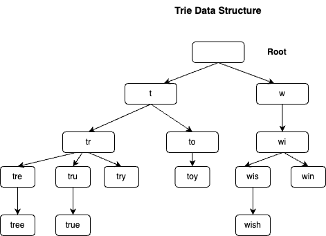
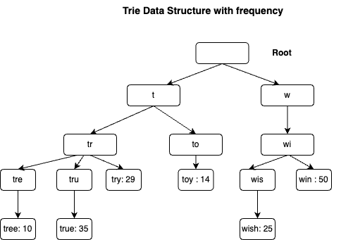
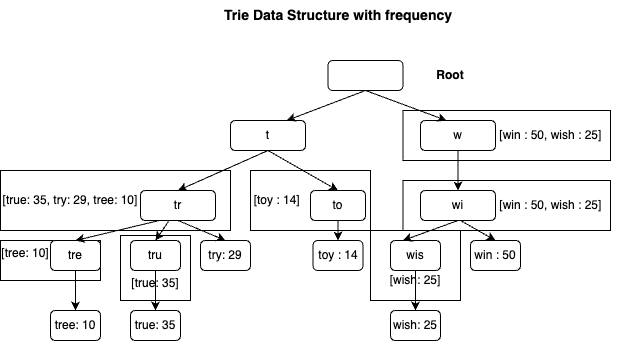

# Design Typeahead (Autocomplete) System

## _Fun. / Non-Fun. Requirements
### Functional Requirements

1. when typing in the search bar, the system should suggest a list of relevant queries in real-time.
2. The suggestions may be either for individual words or full search terms.
3. Search results must be ordered by some ranking scores.
4. The result must be relevant to whatever prefix the user has typed.

### Non-Functional Requirements

1. High availability. (The service should be up 99.9% of the time)
2. Low latency. (The redirection to the original URL should happen in real-time)
3. It's ok if we don't have strong consistency. Owing to the CAP theorem, as availability and partition tolerance are our priority, eventual consistency is fine.
   if two people see different suggestions for a certain time span, it is fine but the system must be available.

## _Traffic and Storage Estimation_
#### Assumptions
* Assume 10 million daily active users (DAU). 
* An average person performs 10 searches per day. 
* 20 bytes of data per query string:
      * Assume we use ASCII character encoding. 1 character = 1 byte 
      * Assumes a query contains 4 words, and each word contains 5 characters on average. 
      * That is 4 x 5 = 20 bytes per query.
      * For every character entered into the search box, a client sends a request to the backend
* for autocomplete suggestions. On average, 20 requests are sent for each search query. For
example, the following 6 requests are sent to the backend by the time you finish typing
“dinner”
   ```
    search?q=d
    search?q=di
    search?q=din
    search?q=dinn
    search?q=dinne
    search?q=dinner
   ```
* ~24,000 query per second (QPS) = 10,000,000 users * 10 queries / day * 20 characters / 24 hours / 3600 seconds.
* Peak QPS = QPS * 2 = ~48,000
* Assume 20% of the daily queries are new. 10 million * 10 queries / day * 20 byte per
  query * 20% = 0.4 GB. This means 0.4GB of new data is added to storage daily.


## _API Design_
1. GET /autocomplete?query=mob&user_id=1234&limit=5
   Response:
    ```json
    {
              "suggestions": ["mobile", "mobility", "mobster", "moby dick", "mobile app"]
    }
    ```
   
2. POST /search/log
   ```json
    {
        "user_id": "123",
        "query": "mobile phone",
        "timestamp": "2025-02-22T10:30:00Z"
      } 
    ```   
    Response 
   ```json
        {
          "message": "Search logged successfully"
        }
    ```


      
## _High-Level Architecture_

### Key Components
1. **Trie data structure**
    * Trie (pronounced “try”) is a tree-like data structure that can compactly store strings. The
      name comes from the word retrieval, which indicates it is designed for string retrieval
      operations.
    * The main idea of trie consists of the following:
       * A trie is a tree-like data structure.
       * The root represents an empty string.
       * Each node stores a character and has 26 children, one for each possible character.
       * Each tree node represents a single word or a prefix string
       * 
       * Basic trie data structure stores characters in nodes. To support sorting by frequency,
         frequency info needs to be included in nodes. Assume we have the following frequency table.
         ````
           Query    Frequency
           -------------------
            tree       10
            try        29
            true       35
            toy        14
            wish       25
            win.       50
         ````
       * After adding frequency info to nodes, updated trie data structure is shown below.
         
       * let us define some terms.
         • p: length of a prefix
         • n: total number of nodes in a trie
         • c: number of children of a given node
       * Steps to get top k most searched queries are listed below:
         * Find the prefix. Time complexity: O(p).
         * Traverse the subtree from the prefix node to get all valid children. A child is valid if it can form a valid query string. Time complexity: O(c)
         * Sort the children and get top k. Time complexity: O(clogc)
         * The time complexity of this algorithm is the sum of time spent on each step mentioned above:
           O(p) + O(c) + O(clogc)
       * The above algorithm is straightforward. However, it is too slow because we need to traverse
         the entire trie to get top k results in the worst-case scenario. Below are two optimizations:
         * Limit the max length of a prefix: 
            * Users rarely type a long search query into the search box. Thus, it is safe to say p is a small
              integer number, say 50. If we limit the length of a prefix, the time complexity for “Find the
              prefix” can be reduced from O(p) to O(small constant), aka O(1)
         * Cache top search queries at each node: 
            * By caching top search queries at every node, we significantly reduce the time complexity to
              retrieve the top 5 queries. The Top 5 queries are stored on each node. For
              example, the node with prefix “tr” stores the following: [“true”: 35, “try”: 29, “tree”: 10]
                
         
         
* **Data gathering service**
  * To design a scalable data gathering service, we examine where data comes from and how
    data is used. Real-time applications like Twitter require up to date autocomplete suggestions.
    However, autocomplete suggestions for many Google keywords might not change much on a
    daily basis.
  * **Analytics Logs**. It stores raw data about search queries. Logs are append-only and are not
    indexed.
     ````
     query          time
     -----------------------------------
     tree.          2025-02-22T10:30:00Z
     try.           2025-02-22T10:30:05Z 
     tree.          2025-02-22T10:30:30Z 
     toy            2025-02-22T10:31:00Z
     tree           2025-02-22T10:31:30Z
     try            2025-02-22T10:32:00Z
     ````
  * **Aggregators ** The size of analytics logs is usually very large, and data is not in the right
  format. We need to aggregate data so it can be easily processed by our system.
  Depending on the use case, we may aggregate data differently. For real-time applications
  such as Twitter, we aggregate data in a shorter time interval as real-time results are important.
  On the other hand, aggregating data less frequently, say once per week, might be good
  enough for many use cases. During an interview session, verify whether real-time results are
  important. We assume trie is rebuilt weekly.
  * **Aggregated Data** : “time” field represents the start time of a week.
    “frequency” field is the sum of the occurrences for the corresponding query in that week. 
    ````
    query      time       frequency
    ----------------------------
    tree       2025-02-02   12000
    tree       2025-02-15   15000
    tree       2025-02-22   9000
    toy        2025-02-02   8500
    toy        2025-02-15   6323
    toy        2025-02-22   8866
    ````
  * **Workers**. Workers are a set of servers that perform asynchronous jobs at regular intervals. They build the trie data structure and store it in Trie DB.
  * **Trie Cache**. Trie Cache is a distributed cache system that keeps trie in memory for fast read. It takes a weekly snapshot of the DB.
  * **Trie DB** : Trie DB is the persistent storage. Two options are available to store the data:
        * Document store: Since a new trie is built weekly, we can periodically take a snapshot of it, serialize it, and store the serialized data in the database. 
        * Document stores like MongoDB are good fits for serialized data.

### high level design
_System.png)

### _Questions_
1. How do you extend your design to support multiple languages?
   * To support other non-English queries, we store Unicode characters in trie nodes. If you are not familiar with Unicode, here is the definition: “an encoding standard covers all the characters for all the writing systems of the world, modern and ancient. 
2. What if top search queries in one country are different from others?
    * We can build a separate trie for each country. Each trie contains top search queries for that country. When a user types a query, we first identify the country and then return the top search queries for that country.
3. How can we support the trending (real-time) search queries?
    * Assuming a news event breaks out, a search query suddenly becomes popular. Our original
      design will not work because:
      * Offline workers are not scheduled to update the trie yet because this is scheduled to run on weekly basis.
      * Even if it is scheduled, it takes too long to build the trie. Building real-time search autocomplete is complicated, so we will only give a few ideas:
        * Reduce the working data set by sharding.
        * Change the ranking model and assign more weight to recent search queries.
        * Data may come as streams, so we do not have access to all the data at once. Streaming data means data is generated continuously. Stream processing requires a different set of systems: Apache Hadoop MapReduce, Apache Spark Streaming, Apache Storm, Apache Kafka, etc.
