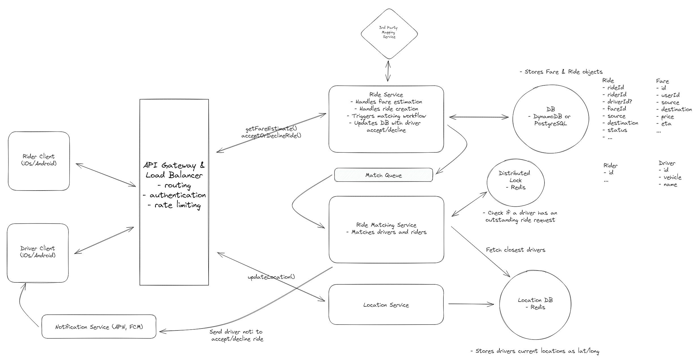

# Design Uber/Ola/Lyft/GrabCar

## _Fun. / Non-Fun. Requirements
### Functional Requirements

1. User should be able to input a start location and a destination and get an estimated fare
2. User should be able to request a ride based on an estimate
3. Drivers should be able to accept/deny a request and navigate to pickup/drop-off

### Non-Functional Requirements

1. low latency matching < 1 min to match aor failure
2. consistency of matching. Ride to a driver is 1:1
3. High availability outside the matching.
4. Handle high throughput, surges for peek hours or special events
## _Traffic and Storage Estimation_
#### Assumptions

* let's assume we have 100 million daily active users with 1 million drivers, and on average, our platform enables 10 million rides per day.
* if on average, each user performs 10 actions (such as request a check-available rides, book rides, etc.). we will have to handle 1 billion requests daily.
   
    ````
      100 million users * 10 actions = 1 billion requests / 3600 * 24 = 11,574 requests per second ~= 12k requests per second
    
    ````
* Peak QPS = 2 * 12k = 24k
#### Storage
* Assume each message on average is 400 bytes, we would need 400 GB of new data per day.
   ````
    1 billion requests * 400 bytes = 400 GB
    after 10 years 
    400 GB * 365 days * 10 years = 1.46 TB
     
  ````

## _API Design_
1.  POST /ride/fare-estimate
    ```json
    {
        "start_location": "1234",
        "destination": "5678"
    }
    ```
    Response:
    ```json
    {
        "fare_estimate": 100
    }
    ```
   
2. PATCH /ride/request
    ```json
    {
        "start_location": "1234",
        "destination": "5678",
        "user_id": "1234"
    }
    ```
    Response:
    ```json
    {
        "message": "Ride request sent"
    }
    ```
3. POST /location/update
    ```json
    {
        "lat": "1234",
        "long": "5678"
    }
4. PATCH /ride/driver/accept
    ```json
    {
        "ride_id": "1234",
        "driver_id": "5678"
    }
    ```
    Response:
    ```json
    {
        "message": "Ride accepted"
    }
    ```
5. PATCH /ride/driver/update
    ```json
    {
        "rideId": "1234",
        "status": "picked-up|droppedoff"
    }
    ```


      
## _High-Level Architecture_

### Key Components
1. **Riders should be able to input a start location and a destination and get an estimated fare**
    * The first thing that users will do when they open the app to request a ride is search for their desired destination. At this point, the client will make a request to our service to get an estimated price for the ride. The user will then have a chance to request a ride with this fare or do nothing.
     Let's lay out the necessary components for communicating between the client and our microservices, adding our first service, “Ride Service” which will handle fare estimations
    * **Third Party Mapping API:** We use a third-party service (like Google Maps) to provide mapping and routing functionality. It is used by the Ride Service to calculate the distance and travel time between locations.
2. Riders should be able to request a ride based on the estimated fare
    * Once a user reviews the estimated fare and ETA, they can request a ride.
    * Then, when a request comes in, this is how we handle it.
      * The user confirms their ride request in the client app, which sends a POST request to our backend system with the id of the Fare they are accepting.
      * The API gateway performs the necessary authentication and rate limiting before forwarding the request to the Ride Service.
      * The Ride Service receives the request and creates a new entry in the Ride table, linking to the relevant Fare that was accepted, and initializing the Ride's status as requested.
      * Next, it triggers the matching flow so that we can assign a driver to the ride
3. Upon request, riders should be matched with a driver who is nearby and available
      * Now we need to introduce some new components to facilitate driver matching.
        * **Driver Client (UI):** In addition to the Rider Client, we introduce the Driver Client, which is the interface for drivers to receive ride requests and provide location updates. The Driver Client communicates with the Location Service to send real-time location updates.
        * **Location Service:** Manages the real-time location data of drivers. It is responsible for receiving location updates from drivers, storing this information in the database, and providing the Ride Matching Service with the latest location data to facilitate accurate and efficient driver matching.
        * **Ride Matching Service:** Handles incoming ride requests and uses a sophisticated algorithm (abstracted away for the purpose of this interview) to match these requests with the best available drivers based on proximity, availability, driver rating, and other relevant factors.
4. Drivers should be able to accept/decline a request and navigate to pickup/drop-off
   * We only need to add one additional service to our existing design : 
      * **Notification Service:** Responsible for dispatching real-time notifications to drivers when a new ride request is matched to them. It ensures that drivers are promptly informed so they can accept ride requests in a timely manner, thus maintaining a fluid user experience. Notifications are sent via APN (Apple Push Notification) and FCM (Firebase Cloud Messaging) for iOS and Android devices, respectively.

**Let's walk through the sequence of events that occur when a driver accepts a ride request and completes the ride:**
   1. After the Ride Matching Service determines the ranked list of eligible drivers, it sends a notification to the top driver on the list via APN or FCM.
   2. The driver receives a notification that a new ride request is available. They open the Driver Client app and accept the ride request, which sends a PATCH request to our backend system with the rideID. a) If they decline the ride instead, the system will send a notification to the next driver on the list.
   3. The API gateway receives the requests and routes it to the Ride Service.
   4. The Ride Service receives the request and updates the status of the ride to "accepted" and updates the assigned driver accordingly. It then returns the pickup location coordinates to the Driver Client.
   5. With the coordinates in hand, the Driver uses on client GPS to navigate to the pickup location.


### high level design


### _Questions_
1. How do we handle frequent driver location updates and efficient proximity searches on location data?
   Managing the high volume of location updates from drivers and performing efficient proximity searches to match them with nearby ride requests is a difficult task, and our current high-level design most definitely does not handle this well. There are two main problems with our current design that we need to solve:
   1. **High Frequency of Writes:** Given we have around 10 million drivers, sending locations roughly every 5 seconds, that's about 2 million updates a second! Whether we choose something like DynamoDB or PostgreSQL (both great choices for the rest of the system), either one would either fall over under the write load, or need to be scaled up so much that it becomes prohibitively expensive for most companies.
   2. **Query Efficiency:** Without any optimizations, to query a table based on lat/long we would need to perform a full table scan, calculating the distance between each driver's location and the rider's location. This would be extremely inefficient, especially with millions of drivers. Even with indexing on lat/long columns, traditional B-tree indexes are not well-suited for multi-dimensional data like geographical coordinates, leading to suboptimal query performance for proximity searches. This is essentially a non-starter.
   
   * **Solution**: Real Time In-memory Geospatial Data Store 
     * We can address all the limitations of the previous solutions by using an in-memory data store like Redis, which supports geospatial data types and commands. This allows us to handle real-time driver location updates and proximity searches with high throughput and low latency while minimizing storage costs with automatic data expiration.
     * Redis is an in-memory data store that supports geospatial data types and commands. It uses geohashing to encode latitude and longitude coordinates into a single string key, which is then indexed using a sorted set. This allows for efficient storage and querying of geospatial data. 
     * Redis provides geospatial commands like GEOADD for adding location data and GEOSEARCH for querying nearby locations within a given radius or bounding box. These commands are highly optimized for geospatial data and can be used to efficiently handle real-time driver location updates and proximity searches. The GEOSEARCH command, introduced in Redis 6.2, replaces and enhances the functionality of the older GEORADIUS and GEORADIUSBYMEMBER commands, offering more flexibility and performance improvements.
     * We no longer have a need for batch processing since Redis can handle the high volume of location updates in real-time. Additionally, Redis automatically expires data based on a specified time-to-live (TTL), which allows us to retain only the most recent location updates and avoid unnecessary storage costs.
   * **Challenges**
     * The main challenge with this approach would be durability. Since Redis is an in-memory data store, there's a risk of data loss in case of a system crash or power failure. However, this risk can be mitigated in a few ways:
        * Redis persistence: We could enable Redis persistence mechanisms like RDB (Redis Database) or AOF (Append-Only File) to periodically save the in-memory data to disk.
        * Redis Sentinel: We could use Redis Sentinel for high availability. Sentinel provides automatic failover if the master node goes down, ensuring that a replica is promoted to master.
     Even if we experience data loss due to a system failure, the impact would be minimal. Since driver location updates come in every 5 seconds, we would only need that long to recover and rebuild the state of our system. This quick recovery time ensures that our system remains robust and reliable, even in the face of potential failures.
2. How can we manage system overload from frequent driver location updates while ensuring location accuracy?
   * High-frequency location updates from drivers can lead to system overload, straining server resources and network bandwidth. This overload risks slowing down the system, leading to delayed location updates and potentially impacting user experience. In most candidates original design, they have drivers ping a new location every 5 seconds or so. This follow up question is designed to see if they can intelligently reduce the number of pings while maintaining accuracy.
     * **Approach**
         * We can address this issue by implementing adaptive location update intervals, which dynamically adjust the frequency of location updates based on contextual factors such as speed, direction of travel, proximity to pending ride requests, and driver status. This allows us to reduce the number of location updates while maintaining accuracy.
         * The driver's app uses ondevice sensors and algorithms to determine the optimal interval for sending location updates. For example, if the driver is stationary or moving slowly, updates can be less frequent. Conversely, if the driver is moving quickly or changing direction often, updates are sent more frequently.
     * **Challenges**
         * The main challenge with this approach is the complexity of designing effective algorithms to determine the optimal update frequency. This requires careful consideration and testing to ensure accuracy and reliability. But, if done well, it will significantly reduce the number of location updates and improve system efficiency.
3. How do we prevent multiple ride requests from being sent to the same driver simultaneously?
    * We defined consistency in ride matching as a key non-functional requirment. This means that we only request one driver at a time for a given ride request AND that each driver only receives one ride request at a time. That driver would then have 10 seconds to accept or deny the request before we move on to the next driver if necessary.
      * **Approach**
         * To solve the timeout issue, we can use a distributed lock implemented with an in-memory data store like Redis. When a ride request is sent to a driver, a lock is created with a unique identifier (e.g., driverId) and a TTL set to the acceptance window duration of 10 seconds. The Ride Matching Service attempts to acquire a lock on the driverId in Redis. If the lock is successfully acquired, it means no other service instance can send a ride request to the same driver until the lock expires or is released. If the driver accepts the ride within the TTL window, the Ride Matching Service updates the ride status to "accepted" in the database, and the lock is released in Redis. If the driver does not accept the ride within the TTL window, the lock in Redis expires automatically. This expiration allows the Ride Matching Service to consider the driver for new ride requests again.
      * **Challenges**
         * The main challenge with this approach is the system's reliance on the availability and performance of the in-memory data store for locking. This requires robust monitoring and failover strategies to ensure that the system can recover quickly from failures and that locks are not lost or corrupted. Given locks are only held for 10 seconds, this is a reasonable tradeoff as the emphemorality of the data makes it easier to recover from failures.
4.  How can we ensure no ride requests are dropped during peak demand periods?
    * During peak demand periods, the system may receive a high volume of ride requests, which can lead to dropped requests. This is particularly problematic during special events or holidays when demand is high and the system is under stress. We also need to protect against the case where an instance of the Ride Matching Service crashes or is restarted, leading to dropped rides.
      * **Approach**
          * To address this issue; we can introduce a queueing system with dynamic scaling. When a ride request comes in, it is added to the queue. The Ride Matching Service then processes requests from the queue in a first-come, first-served manner. If the queue grows too large, the system scales horizontally by adding more instances of the Ride Matching Service to handle the increased load. This allows us to scale the system dynamically based on demand, ensuring that no requests are dropped. We can also partition the queues based on geographic regions to further improve efficiency.
          * We could use a distributed message queue system like Kafka, which allows us to commit the offset of the message in the queue only after we have successfully found a match. This way, if the Ride Matching Service goes down, the match request would still be in the queue, and a new instance of the service would pick it up. This approach ensures that no ride requests are lost due to service failures and provides fault tolerance to our system.
      * **Challenges**
          * The main challenge with this approach is the complexity of managing a queueing system. We need to ensure that the queue is scalable, fault-tolerant, and highly available. We can address this by using a managed queueing service like Amazon SQS or Kafka, which provides these capabilities out of the box. This allows us to focus on the business logic of the system without worrying about the underlying infrastructure.
          * The other issue with this approach is that since it is a FIFO queue, you could have requests that are stuck behind a request that is taking a long time to process. This is a common issue with FIFO queues and can be addressed by using a priority queue instead. This allows us to prioritize requests based on factors like driver proximity, driver rating, and other relevant factors. This ensures that the most important requests are processed first, leading to a better user experience.
5. How can you further scale the system to reduce latency and improve throughput?
    * **Approach**
       * A better approach is to scale horizontally by adding more servers. We can do this by sharding our data geographically and using read replicas to improve read throughput. This allows us to scale the system to handle more requests while reducing latency and improving throughput. Importantly, this not only allows us to scale but it reduces latency by reducing the distance between the client and the server. This applies to everything from our services, message queue, to our databses -- all of which can be sharded geographically. The only time that we would need to scatter gather (i.e., query multiple shards) is when we are doing a proximty search on a boundary.
   * **Challenges**
       * The main challenge with this approach is the complexity of sharding and managing multiple servers. We need to ensure that data is distributed evenly across shards and that the system can handle failures and rebalancing. We can address this by using consistent hashing to distribute data across shards and by implementing a replication strategy to ensure that data is replicated across multiple servers. This allows us to scale the system horizontally while maintaining fault tolerance and high availability.