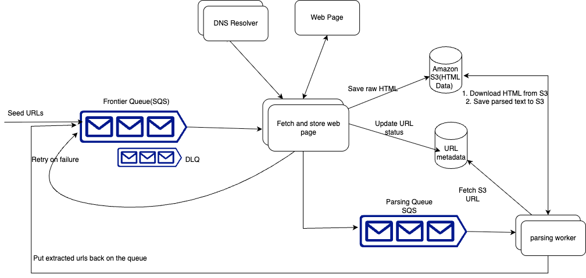

# Design Web-Crawler

## _Fun. / Non-Fun. Requirements
### Functional Requirements
1. Crawl the web starting from a given set of seed URLs.
2. Extract text data from each web page and store the text for later processing.


### Non-Functional Requirements
1. Fault tolerance to handle failures gracefully and resume crawling without losing progress.
2. Politeness to adhere to robots.txt and not overload website servers inappropriately.
3. Scalability to handle 10B pages.


## _Traffic Estimation and Data Calculation_
#### Assumptions


#### storage estimation
```text
1. Target Scope
    Assuming total pages to crawl = 10M
     average page size = 100KB
     crawl frequency = 1 full crawl per week
     Crawled data size = 10M * 100KB = 1TB
2. Bandwidth
    if we are crawling 1TB per week 
    Bandwidth = 1TB / 7 days ~= 150 GB/day
    Hourly Bandwidth = 150GB / 24 hours ~= 6.25 GB/hour
    Network Bandwidth = 6.25 GB/hour / 3600 seconds ~= 1.74 MB/s ~= 14Mbps
3. Storage
    Assuming we are storing 1TB of crawled data per week
    Storage = 1TB * 4 weeks = 4TB/month
    Storage = 4TB * 12 months = 48TB/year
    Storage = 48TB * 10 years = 480TB
```


## _API Design_
```text
        | Method | Endpoint        | Description                                   |
        | ------ | --------------- | --------------------------------------------- |
        | POST   | /crawl/start    | Start a crawl with a list of seed URLs        |
        | POST   | /crawl/stop     | Stop a currently running crawl                |
        | GET    | /crawl/status   | Get status (e.g., running, paused, completed) |
        | POST   | /crawl/pause    | Pause a running crawl                         |
        | POST   | /crawl/resume   | Resume a paused crawl                         |
```
      
## _High-Level Architecture_
### Key Components
1. **Frontier Queue**: The queue of URLs we need to crawl. We will start with a set of seed URLs and add new URLs as we crawl the web. The technology used could be something like Kafka, Redis, or SQS. We'll decide on the technology later.
2. **Crawler**: Fetches web pages, extracts text data, and extracts new URLs to add to the frontier queue.
3. **DNS resolver**: Resolves domain names to IP addresses so that the crawler can fetch the web pages. There are interesting discussions to be had about how to cache DNS lookups, handle DNS failures, and ensure that we are not overloading DNS servers.
4. **Webpage**: The external server that hosts the web pages we are crawling. We'll fetch the HTML from these servers and extract the text data.
5. **Amazon S3**: This is where we'll store the text data we extract from the web pages. We choose S3 as our blob storage because it is highly scalable and durable. It is designed to store large amounts of data cheaply. Other hosted storage solutions like Google Cloud Storage or Azure Blob Storage could also be used.

### high level design


### Database Design

### _Questions_
1. How can we ensure we are fault-tolerant and don't lose progress?
   *  URL fetching is clearly the most likely task to fail. Many websites may no longer exist, may have moved, or may be down. Others may just be slow or experiencing momentary downtime. To confirm, we'll want to retry on failures
        * **SQS with exponential backoff**: SQS supports retries with configurable exponential backoff out of the box—convenient! No need to implement our own retry logic. Initially, messages that fail to process are retried once per the visibility timeout, with the default being 30 seconds. The visibility timeout increases exponentially after each retry attempt—30 seconds, 2 minutes, 5 minutes, and up to 15 minutes. This strategy helps to manage message processing more efficiently without overwhelming the system.
            To prevent excessive delays, it is common to cap the exponential backoff at a maximum value. After a certain number of failures, as determined by the ApproximateReceiveCount, the message is moved to a dead-letter queue (DLQ). At this stage, the message is considered unprocessable. For our purposes, we'll consider the site offline, and thus unscrapable, after 5 retries.
   * **What happens if a crawler goes down**: we spin up a new one. We'll just have to make sure that the half-finished URL is not lost and the URL will stay in the queue until it is confirmed to have been fetched by a crawler, and the HTML is stored in blob storage.
   * **SQS**: SOS's built-in support for retries and exponential backoff and the ease with which visibility timeouts can be configured, we'll use SQS for our system.
2. How can we ensure politeness and adhere to robots.txt?
   * **Politeness** refers to being respectful with the resources of the websites we are crawling. This involves ensuring that our crawling activity does not disrupt the normal function of the site by overloading its servers, respecting the website's bandwidth, and adhering to any specific restrictions or rules set by the site administrators.
   * **robots.txt**: is a file that websites use to communicate with web crawlers. It tells crawlers which pages they are allowed to crawl and which pages they are not. It also tells crawlers how frequently they can crawl the site. An example of a robots.txt file might look like this:
      ```text
            User-agent: * 
            Disallow: /private/
            Crawl-delay: 10
      ```
   * To ensure politeness and adhere to robots.txt, we will need to do two things:
        * **Respect robots.txt**: Before crawling a page, we will need to check the robots.txt file to see if we are allowed to crawl the page. If we are not allowed to crawl the page, we will need to skip it. We will also need to respect the Crawl-delay directive and wait the specified number of seconds between requests.
        * **Rate limiting**: We will want to limit the number of requests we make to any single domain. The industry standard is to limit the number of requests to 1 request per second. 