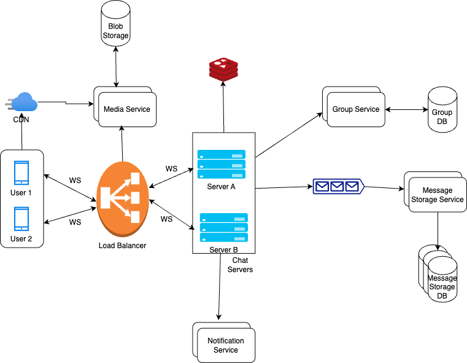

# Design WhatsApp

## _Fun. / Non-Fun. Requirements
### Functional Requirements
1. support 1:1 real-time messaging between users.
2. show online/offline status and last seen time of users.
3. show message delivery status (sent, delivered, read).
4. Allow users to share images, videos, and audio clips.
5. support group chats with up to 100 members.
6. send push notifications for new messages if the receiver is offline.
7. store and retrieve chat history.


### Non-Functional Requirements
1. **Scalability**: The system should be able to handle millions of users and messages.
2. **Availability**: The system should be highly available, with minimal downtime.
3. **Latency**: Messages should be delivered in real-time, with minimal delay.
4. **Reliability**: The system should ensure message delivery, even in case of network failures.


## _Traffic Estimation and Data Calculation_
#### Assumptions
```text
lets assume 
        * total users = 1 billion
        * DAU = 50% of total users = 500 million
        * average messages sent per user per day = if each active user sends 10 messages per day, 
                             then total messages = 500 million * 10 = 5 billion messages per day
```

#### storage estimation
```text
    Assuming each message is around 1KB 
        * Daily storage = 5 billion messages * 1KB = 5 TB
        * Yearly storage = 5 TB * 365 =~ 1.8PB
```


## _API Design_
      
## _High-Level Architecture_
### Key Components
* **Chat Servers:** The chat servers manage a large number of concurrent connections, facilitate real-time communication and ensure that messages are delivered efficiently between users with minimal latency.
                To Support seamless tow way messaging, a protocol like WebSocket is used.WebSocket is designed for bidirectional communication between client and server, allowing for real-time updates and notifications.
* **Load Balancer:** The load balance efficiently distributes incoming traffic from users to multiple instances of chat servers and user facing services, such as the media service.
     * Let's see how a connection is established between user and chat server via load balancer.
        * Initial Connection: the client initiates an HTTP(S) request to set a WebSocket connection. The request passes through the load balancer, which routes it to an appropriate chat server based on the user's current location and load balancing algorithm.
        * Connection Upgrade: Once the request reaches the selected chat server, the connection is upgraded from HTTP to WebSocket. 
        * Session Persistence: To ensure that the client remains connected to the same chat server, load balancer uses sticky session. This can be achieved through IP hashing where the load balancer consistently routes requests from the same client IP to the same chat server based on the hash of their IP address.
* **User Connection Cache:** The User Connection cache is a fast in-memory cache(redis) that stores each user active connection details, such as the chat server they are connected to and their last active timestamp. 
    ```text
      UserId    ServerId    LastActive
      101       svr-1      2023-10-01 12:00:00
      102       svr-2      2023-10-01 12:05:00
      103       svr-3      2023-10-01 12:10:00
     ```
    * Clients periodically send heartbeat signals to their connected server, and each heartbeat updates the user's last active timestamp in the cache.
    * This setup enables efficient support for online/offline status and last seen time of users.
* **Notification service:** The Notification service is responsible for delivering real-time notification to users, especially when they are offline or not actively using the application.
                        When a user is offline, the char server forwards the message to the notification service, which then sends a push notification to the user's device.
* **Message Queue:** The Message queue is a distributed, high throughput queue (Kafka) that temproary stores the message before they are consumed by message storage service.
* **Message Storage Service:** The Message storage is a distributed database (Cassandra) that stores all the messages sent and received by users. 
    * Each message is stored with metadata, such as sender ID, receiver ID, timestamp, and delivery status.
    * The database is designed to handle high write and read throughput, ensuring that messages can be retrieved quickly.
* **Group Service:** The Group service manages group chats, including creating groups, adding/removing members, and sending messages to groups.
    * Each group is stored in the database with its members and their roles (admin/member).
    * The group service also handles message delivery to all group members and ensures that the message delivery status is updated for each member.
* **Media Service:** The Media service is responsible for handling media files (images, videos, audio clips) shared between users.
    * When a user sends a media file, it is uploaded to the media service, which stores the file and generates a unique URL for it.
    * The media service also handles the retrieval of media files when users request them.
* **CDN:** The Content Delivery Network (CDN) is used to cache and deliver media files to users efficiently. 
    * When a user requests a media file, the CDN serves it from the nearest edge location, reducing latency and improving load times.
    * The media service generates signed URLs for media files, ensuring secure access to the files.
### high level design


### Database Design


### _Questions_
1. **Why choose WebSocket over HTTP for real-time messaging?**
   * **issues with HTTP:**
        * **Polling:** In polling, the client periodically sends HTTP requests to the server to check for new messages.
              * Drawbacks: Polling can be resource-intensive, especially with high polling frequency. Since the server responds with "no new messages" most times, this approach can add substantial overhead and waste server resources. 
        * **Long Polling:** In long polling, the client sends an HTTP request to the server and keeps the connection open until the server has new data to send.
              * Drawbacks: Long polling can still lead to increased latency and resource usage, as the server needs to maintain many open connections.
   * **WebSocket** is designed for bidirectional communication, allowing real-time updates and notifications. It reduces latency and overhead compared to traditional HTTP polling.
2. **how Real-time Message Delivery happens?** 
   * **Establishing the Connection:** When a user opens the chat app, it initiates a WebSocket connection with one of the chat servers. This persistent connection remains open throughout the chat session, enabling real-time communication between the client and server without requiring repeated HTTP requests.
   * **Sending Messages:** Once connected, when User A sends a message, to User B, the message travels through User A’s WebSocket connection to the server managing that connection (Server A). Server A then looks up the user connection cache to determine whether User B is online and, if so, which server currently holds User B's connection.       
        * If User B is online: Server A forwards the message to Server B, which delivers it to User B via their open WebSocket connection. 
        * If User B is offline: Server A sends the message to the notification service, which triggers a push notification to notify User B of the new message. 
3. **Message Delivery Indicators**
   * **WebSocket** enables real-time status updates for message(eg. sent, delivered, read), providing immediate feedback to users.
   * **Message Sent:** When User A sends a message, it is transmitted over their WebSocket connection to the server handling their connection.
         * Server A receives the message, pushes it to the message queue for storage, and sends an acknowledgment back to User A over the WebSocket connection.
         * Upon receiving the acknowledgment, User A's client updates the message status to "sent."
         * If User A is offline when attempting to send a message, the message won’t be sent until they are back online. The message remains in a pending state on User A's device until it reconnects and successfully sends the message to Server A.
   * **Message Delivered:** When Server B receives the message from Server A, it forwards it to User B's WebSocket connection.
         * Upon successful delivery, Server B sends an acknowledgment back to Server A, which then updates the message status to "delivered" for User A.
   * **Message Read:** When User B opens the chat app and reads the message, their client sends a read receipt back to Server B.
         * Server B then forwards this read receipt to Server A, which updates the message status to "read" for User A.
4. **Group Messages:** 
   * When User A sends a message in a group chat, the message travels through User A’s WebSocket connection to the server managing that connection (Server A). 
   * Server A queries the Group Service to retrieve a list of all active members in the group. Server A checks the user connection cache to determine which group members are currently online and the specific servers they are connected to.
   * For Each Online Member:
        * If a member is connected to Server A, it delivers the message directly over the existing WebSocket connection. 
        * If a member is connected to a different server (e.g., Server B), Server A forwards the message to Server B, which then delivers the message to the user over their WebSocket connection.
   * For offline group members, 
        * Server A sends the message to the Notification Service. The Notification Service triggers push notifications for each offline group member, alerting them of the new message.
5. **What will happen in case of Chat Server Failure?** 
   * In the event of chat server failure, all clients connected to that server will lose their WebSocket connection. To recover, clients automatically attempt to reconnect, this time establishing a new connection with a different available server
   * The load balancer continuously monitors the health of each chat server through regular health checks. if a server goes down, the load balancer immediately stops directing traffic to that server and reroutes all incoming requests to the remaining healthy servers.
6. **Sharding**
   * User Data Sharding: Shard user data based on user_id. This will allow us to distribute user records across multiple servers and enable us to scale as the user base grows. 
   * Message Data Partitioning: Partition messages based on message_id, using a timestamp-based message_id to enable efficient time-based searches. This structure allows recent messages to be accessed quickly and older messages to be located based on timestamp.