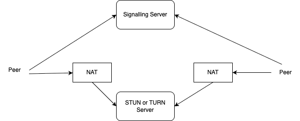
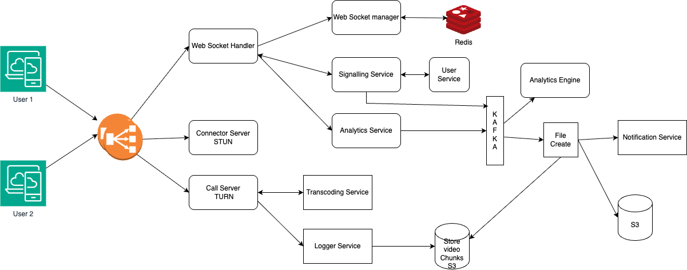

# Design Zoom/WhatsApp Video Call/Facebook Video Call

## _Fun. / Non-Fun. Requirements
### Functional Requirements
1. One to one call
2. group video call
3. audio/video screen share
4. record the video


### Non-Functional Requirements
1. Superfast
2. Highly available
3. Data loss


## _Traffic Estimation and Data Calculation_
#### Assumptions
```text
        Assume Zoom has 300 million daily meeting participants.
        Average meeting duration is 40 minutes to 1 hr..
        
        Video conferencing data usage: around 1 GB per hour per participant.
        
        Total Daily Usage:
           Total participant-hours per day = 300 million participants * (40/60) hours 
           ≈ 200 million participant-hours.
        
        Total daily data = 200 million participant-hours * 1 GB per hour ≈ 
            200 million GB (200 PB) per day.
        
        Cache Estimation:
        User Data that include Profiles, preferences, authentication tokens.
        Each user’s profile and preferences take around 10 KB.
        Total user data = 300 million * 10 KB = 3 TB.
        
        Meeting Metadata will have Meeting IDs, participant lists, schedules.
        
        Static Assets include UI resources, images, CSS, JavaScript files.
        
        API Responses for Frequently accessed data from APIs.
        
        Transcoding Results will have Cached results of recorded meetings that have been processed.
        
        Assume 1% of meetings are recorded and transcoded.
        Each recorded meeting averages 500 MB.
        
        Total transcoding cache = 100 million * 1% * 500 MB = 500 TB.
        
        Server resources: 
        Assume each server handles 1000 concurrent streams.
        Concurrent streams at peak = 300 million / 2 (considering multiple meetings) 
             = 150 million.
        
        Number of servers = 150 million / 1000 = 150,000 servers.
        
        Bandwidth: Assume each stream needs 1 Mbps.
        
        Peak bandwidth = 150 million * 1 Mbps = 150 Tbps.
```


## _API Design_
      
## _High-Level Architecture_
### Key Components
* WebSocket: 
   * WebSocket is a protocol that provides full-duplex communication channels over a single TCP connection. It is designed for real-time applications, allowing for low-latency communication between clients and servers.
   * WebSocket is ideal for chat applications because it allows for real-time message delivery without the overhead of traditional HTTP requests.
   * It provides a communication channel over HTTP through TCP (Transmission Control Protocol).
* How does TCP work? 
   * TCP is a connection-oriented protocol that establishes a reliable connection between two endpoints before data transmission begins. 
   * It ensures that data packets are delivered in order and without errors, making it suitable for applications where data integrity is crucial.
   * Packet is the basic unit of data that is transmitted over a network.
* UDP: 
   * UDP (User Datagram Protocol) is a connectionless protocol that allows for faster data transmission but does not guarantee delivery or order of packets. 
   * It is often used for applications where speed is more important than reliability, such as video streaming or online gaming.
* WebRTC: 
   * WebRTC is an open-source project that enables real-time voice, text and video communication between web browsers and devices.
   * WebRTC connects users by transmitting real time audio and video data over peer-to-peer connections.
   * In Situations where users are on different networks that have NAT (Network address translation) firewalls that prevent RTC, WebRTC uses STUN (Session Traversal Utilities for NAT) and TURN (Traversal Using Relays around NAT) servers to facilitate the connection.
     
   * This enables a given IP address to be translated into a public IP address so peer connections can be established, but there are also networks that are so restrictive that even STUN servers cannot help. In these cases, WebRTC uses TURN (Traversal using Relays around NAT) servers, which relays traffic between users enabling them to connect.
### high level design


### Database Design


### _Questions_
