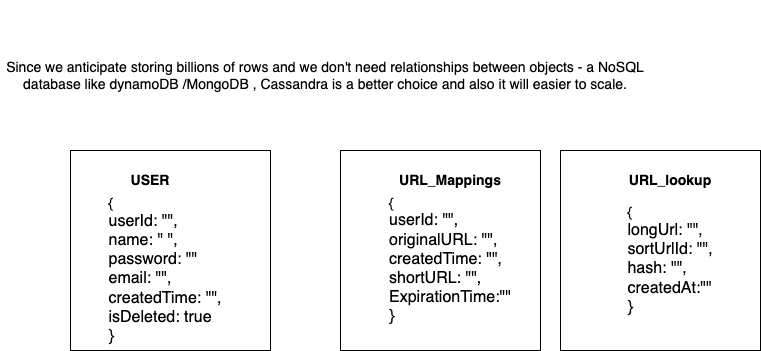

# Design a URL shortener

## _Fun. / Non-Fun. Requirements
### Functional Requirements

1. Generate a unique short URL for a given long URL.
2. Redirect to the original URL when a short URL is accessed.
3. Allow user to customise their short URL (Optional).
4. Support link expiration, after which the short URL will not redirect to the original URL.
5. Track the number of times a short URL is accessed.
6. Analytics for a short URL, such as a number of times it was accessed, geographical location, browsers, etc.

### Non-Functional Requirements

1. High availability. (The service should be up 99.9% of the time)
2. Low latency. (The redirection to the original URL should happen in real-time)
3. Scalability (The system should be able to handle a large number of new URL shortenings and redirections)
4. Durability (Shortened URLs should not be lost)
5. Security to prevent malicious use, such as phishing attacks.

## _Traffic Estimation and Data Calculation_
#### Assumptions
1. 500M new URL shortenings per month.
2. read:write ratio is 100:1.

#### throughput requirement

* write URL per second = 500M / (30 days * 24 hours * 3600 seconds) = ~200 URLs/s
* read URL per second = 200 * 100 = 20K URLs/s

#### storage estimation

* For each shortened URL, we need to store 
   * the short URL: 7 character(Base62 encoded)
   * the original URL: 100 character(avg)
   * the creation date: 8 bytes (timestamp)
   * the expiration date: 8 bytes (timestamp)
   * click count: 4 bytes (integer)
* Total: 7 + 100 + 8 + 8 + 4 = 127 bytes
* storage requirement for one year: 
   * Total URLs for one year = 500M * 12 = 6B
   * Total storage = 6B * 127 bytes = 762 GB


## _API Design_
1. POST api/v1/shorten
    ```json
    {
      "long_url": "https://www.google.com",
      "custom_alias": "",
      "expiration_date": "2022-12-31T23:59:59",
       "user_id": "1234"
    }
    ```
   Response:
    ```json
    {
      "short_url": "http://short.ly/abc123",
      "long_url": "https://www.google.com",
      "expiration_date": "2022-12-31T23:59:59",
      "created_at": "2022-12-31T23:59:59"
    }
    ```
   
2. GET api/v1/{short_url}
   this endpoint redirects the user to the original URL.
   response 
   ```json
    {
      "long_url": "https://www.google.com"
    }
    ```


      
## _High-Level Architecture_
### Key Components
1. **URL Generator Service**
    * The primary function of the service is to generate a short, unique URL for each long URL provided by the user. 
    * Here are some things to think about when picking an algorithm to shorten the URL:
        * URL Length: Shorter is generally better, but it limits the number of possible distinct URLs you can generate. 
        * Scalability: The algorithm should work well even with billions of URLs. 
        * Collision Handling: The algorithm should be able to handle duplicate url generations.
        * Solutions to Handle Duplicate URLs: 
           * Hashing the Long URL: Before generating the short URL ID, you can create a hash of the long URL and use it to check for duplicates in your database.
           * Compute a hash (e.g., SHA-256, MD5) of the long URL to create a fixed-size identifier. Truncate the hash to reduce storage overhead (e.g., use the first 10-12 characters).
             ```lua
              Hash("https://example.com/some-page") => "3d790c7a12"
             ```
           * Check the Database: 
                * Use the hash as the key to look up existing entries in the database.
                * If the hash exists, retrieve and return the corresponding short URL.
                * If the hash does not exist, proceed to generate a new short URL ID using Snowflake.
                * example 
                 ``` json
                  {
                  "longUrl": "https://example.com/some-page",
                  "shortUrlId": "abc123",
                  "hash": "3d790c7a12"
                  }
                 ```
        * Unique ID Generation: Distributed ID generation strategies (like Twitter’s Snowflake) can be used to maintain scalability while preserving uniqueness
* **Redirection Service**
  * The redirection service is responsible for redirecting users to the original URL when they access the short URL.
  * This involves two key steps:
    * Database Lookup: The Service Layer queries the database to retrieve the original URL associated with the short URL. This lookup needs to be optimized for speed, as it directly impacts the user experience. 
    * Redirection: Once the long URL is retrieved, the service issues an HTTP redirect response, sending the user to the original URL.
          ```lua
           Example Workflow:
           A user clicks on https://short.ly/abc123.
           The Redirection Service receives the request and extracts the short URL identifier (abc123).
           The service looks up abc123 in the database or cache to find the associated long URL.
           The service issues a 301 or 302 HTTP redirect response with the Location header set to the long URL (e.g., https://www.example.com/long-url).
           The user's browser follows the redirect and lands on the original URL.
           ```
      * Caching for Performance
               * To improve performance, you can cache the mapping between short and long URLs in a distributed cache like Redis or Memcached.
* **Analytics Service**
    * The analytics service tracks the number of times a short URL is accessed and provides insights into user behavior.
    * Event Logging: Use a message queue (e.g., Kafka) to log each click event. This decouples the analytics from the core redirection service, ensuring that it doesn’t introduce latency. 
    * Batch Processing: Process logs in batches for aggregation and storage in a data warehouse for later analysis.
      * This service can store data such as
              * Number of Clicks: The total number of times a short URL has been accessed.
              * Geographical Location: The geographic distribution of users who have accessed the short URL.
              * Browsers: The types of browsers used to access the short URL.
              * Time of Access: The time and date when the short URL was accessed.
              * Example Data Model:
              ```json
                  {
                  "shortUrlId": "abc123",
                  "clicks": 1000,
                  "geographicalLocation": {
                      "US": 500,
                      "UK": 300,
                      "IN": 200
                  },
                  "browsers": {
                      "Chrome": 600,
                      "Safari": 300,
                      "Firefox": 100
                  }
                  }
              ```
### _End-to-End Request Flow_


### high level design


### Database Design


### _Questions_
1. What are Snowflake IDs?
   * Snowflake is a distributed ID generation algorithm originally developed by Twitter. It generates unique IDs in a decentralized manner without requiring a central coordinator like Zookeeper.
   * Snowflake IDs are 64-bit integers that are composed of three parts:
        * Timestamp: The first 41 bits represent the timestamp of ID generation, with millisecond precision. The current timestamp in milliseconds since a custom epoch. This ensures IDs are time-ordered.
        * Datacenter ID: The next 5 bits represent the ID of the datacenter where the ID is generated. Allows up to 32 datacenters.
        * Machine ID: The next 5 bits represent the ID of the machine (or app server) generating the ID. Allows up to 32 machines (or app server) per datacenter.
        * Sequence Number: The last 12 bits represent a sequence number that is incremented for each ID generated within the same millisecond. This prevents collisions when multiple IDs are generated within the same millisecond.Supports up to 4,096 IDs per millisecond per machine.
2. example schema for the event published by redirection service
   ```json
    {
    "eventId": "uuid-12345",
    "timestamp": "2025-01-16T12:34:56Z",
    "shortUrl": "tiny.xyz/abc123",
    "originalUrl": "https://www.example.com",
    "userId": "user-6789",        // Optional, if users are logged in
    "ipAddress": "192.168.1.1",
    "userAgent": "Mozilla/5.0 (Windows NT 10.0; Win64; x64)",
    "geoLocation": {
                    "country": "USA",
                    "region": "California",
                    "city": "San Francisco"
                  },
    "referrer": "https://www.google.com",
    "redirectTimeMs": 12          // Time taken to process the redirect
    }
   ```
