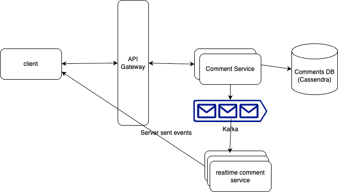
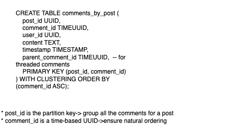

# Design Live Comments System

## _Fun. / Non-Fun. Requirements_
### Functional Requirements
1. Viewers can post comments
2. viewers can see all the comments posted in near real-time
3. Viewers can see all the comments posted before they joined 
4. 

### Non-Functional Requirements
* The system should scale to support millions of concurrent videos and thousands of comments per second per live video
* The system should prioritize availability over consistency, eventual consistency is fine
* The system should have low latency, broadcasting comments to viewers in near-real time (< 200ms end-to-end latency under typical network conditions)

## _Traffic Estimation and Data Calculation_
#### Assumptions and storage
1. Daily active posts with comments	-> 1 million 
2. Avg comments per post per day -> 100 
3. Avg comment size	-> 300 bytes
 ``` text 
   1. Comment Volume
       1 million posts * 100 comments/post/day = 10^6 * 10^2 = 100 million comments/day
   2. Cassandra Storage
       assuming Total per comment: ~500 bytes
       100 million comments/day * 500 bytes = 50 GB/day
   3. QPS
         100 million comments/day / 24 hours = 4.16 million comments/hour
         4.16 million comments/hour / 3600 seconds = ~1150 comments/second 
 ```


## _API Design_

1. **Viewers tp post a comment**
    * Endpoint: POST /comments/postId
    * Response:
      ```json
      {
         "video_id" : 123,
         "author_id" : 5678,
         "content" : "sample comment"
      }
      ```
2. **Viewers to get all comments**
    * Endpoint: GET /comments/postId?cursor={last_comment_id}&direction={before|after}&pageSize=50
    * Response:
      ```json
      {
         "comments" : [
            {
               "comment_id" : 123,
               "comment" : "sample comment",
               "timestamp" : 127800988978
            },
            {
                "comment_id" : 124,
               "comment" : "sample comment response",
               "timestamp" : 127800988978
            }
         ]
      }
      ```

## _High-Level Architecture_
### Data flow and Key Components

1. What Exists When the First Comment Is Posted?
   * Comment is sent → saved to DB → pushed to Kafka.
   * Kafka delivers to one Realtime Comment Service instance.
   * That instance checks its in-memory map (Map<postId, List<ConnectedClient>>) and sees… nothing — no clients are connected yet.
   * So, When and How Do Realtime Services Get Connection Info?
       * Clients Must First Connect via SSE/WebSocket
           * Client initiates SSE/WebSocket connection, for example,
                  GET /stream/comments?postId=123 
           * Realtime Comment Service accepts the connection. 
           * It registers the client in memory:
                   connectionMap.getOrCreate(postId).add(connection);
           * Now, when a Kafka event comes in for postId=123, this service can push the comment.
* 


### high level design


### Database design


### _Questions_
1. 
